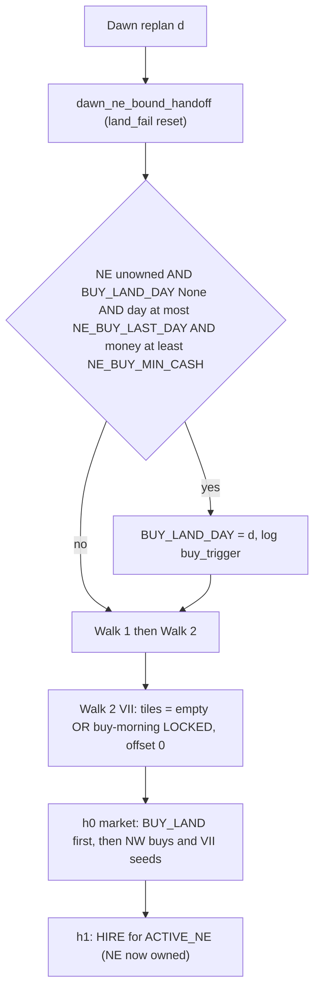

# Cash trigger for the NE land buy

## Why the current trigger misfires
Right now `BUY_LAND_DAY` is set only when zone VII's mini-solve is accepted in `_activate_next_ne` ([milos/planner.py](milos/planner.py)). That acceptance depends on three things:
- that day's CP-SAT result (`ok=0` means infeasible or time-limited, and CP-SAT runs non-deterministically with 8 workers),
- the price forecast,
- `cost` from the chosen chains.

So identical farms get different buy days, or never buy (114594303). The downloaded Kaggle data is replays only, so the `[ne]` lines can't show which gate rejected. Rather than tuning the gate, take the solver out of the land decision entirely.



## Changes

### [milos/planner.py](milos/planner.py)
- Add two constants: `NE_BUY_MIN_CASH = 2500` (land $1000 plus about $1.5k buffer, inside the 2–4k target band) and `NE_BUY_LAST_DAY = 22`.
- Add `_maybe_trigger_ne_buy(me, day)`. When NE is unowned, `BUY_LAND_DAY is None`, `day <= NE_BUY_LAST_DAY` and `money >= NE_BUY_MIN_CASH`, it sets `BUY_LAND_DAY = day` and logs `[ne] buy_trigger d=.. money=..`.
- Call it from `replan()` after `dawn_ne_bound_handoff` and before the walks, inside its own `try/except` that logs `buy_trigger failed`.
- Change `_activate_next_ne` so zone VII no longer drives the land buy:
  - Remove the `offset=1` path and the `BUY_LAND_DAY = day + 1` set. Every activation uses `offset = 0`.
  - The front zone is allowed when NE is owned **or** `BUY_LAND_DAY == day`. Otherwise it returns.
  - The tile filter keeps `None`/WEED tiles, plus `is_buy_morning_locked(tile, idx, day, me)` tiles, so VII can plan on buy morning.
  - Cash gate: set `reserve = NE_LAND_COST if BUY_LAND_DAY == day and NE is unowned else 0`, then require `money - cost - reserve >= 0`.
  - Busy gate for every zone, VII included: `busy_day0 < 1` rejects. A VII reject only delays staffing to the next dawn; the land is already bought.
  - Set `NE_DUE_DAY[worker] = day`.
- `dawn_ne_bound_handoff` stays as is: if `day > BUY_LAND_DAY` and NE is still unowned, it rolls back and clears `BUY_LAND_DAY`, and the trigger can fire again on the same dawn.

### [milos/executor.py](milos/executor.py)
- `_empty_at_dawn` is computed in `_on_new_day` before `replan()` sets `BUY_LAND_DAY`, so on buy morning the NE tiles would be missing from it. After the `planner.replan(...)` call, recompute it when `planner.BUY_LAND_DAY == day`:

```python
self._empty_at_dawn = {
    idx for idx in range(workers.NUM_TILES) if _dawn_empty(me, idx, day)
}
```

  Without this, `needed_buys` won't buy VII seeds or animals at h=0, and `tile_ops` can't `PLANT` or `PLACE` on buy day.

### Unchanged
- [milos/market.py](milos/market.py) already puts `BUY_LAND` first at h=0 with a $1000 reserve, and adds the NE `HIRE` orders at h=1.
- VIII onward: same Walk 2 path and gates.

## Verify (local only)
- Run `scripts/smoke_test.sh` 2–3 times and grep `rg "\[ne\]|BUY_LAND|walk[12] failed|buy_trigger"`.
- Expect:
  - `buy_trigger` on the first dawn with money of at least 2500 (early days)
  - `BUY_LAND` on the same day's h=0
  - `[ne] accept ... zone=hire6` on that same day or the next
  - no `land_fail` rollback
  - the smoke script reports passed
- Do not submit unless asked.

## Tunables
`NE_BUY_MIN_CASH` and `NE_BUY_LAST_DAY` are single constants. Adjust them after looking at the ladder results.