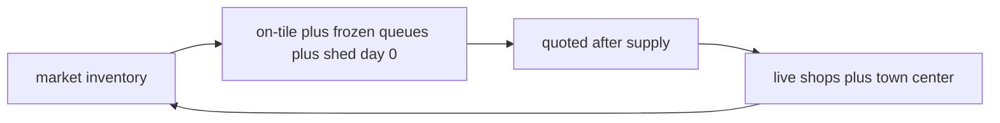

# Daily conservative price path for replan

Day-0 stays flat I0. Only dawn replan in [`milos/planner.py`](milos/planner.py) changes. [`milos/sell_dp.py`](milos/sell_dp.py) is untouched.

This wave changes three things at once: the new inventory walk, deletion of `_glut_unit_price`, and deletion of `effective_price` / opponent tile-count scaling. They ship together. The sanity-check todo runs before wiring so a regression is not the first time the walk is looked at.

## What the path includes

Start each product at `obs["market"]["inventory"]`. For each remaining day:

- **Supply (sold that day):** our on-tile harvests, opponent on-tile harvests, queue suffixes on frozen tiles, and our whole shed on relative day 0.
- **Frozen vs replan:** a tile is frozen when `replan_eligible` is false ([`milos/replan_lock.py`](milos/replan_lock.py)). Its queue suffix is committed and counts as supply. Replan-eligible tiles contribute nothing — not their current queue, and not the candidate pattern being scored. A pattern must not depress its own price.
- **Sinks:** shops already unlocked, plus town center. No future shop unlocks. Daily shop drain is `shop_demand_by_product(unlocked)[product] * (24/4)`. [`SHOP_PRODUCT_DEMAND`](milos/rollouts.py) already stores Yarn Store wool and Pet Cafe carrot as 2 per tick, so those are 12/day, not 6. Do not hardcode 6 per product. Town center is 2/day before day 10, 4/day from day 10, 8/day from day 20 (`units * 24/12` in sell_dp).
- **Price:** walk the supply through [`milos/pricing.py`](milos/pricing.py) `quoted`. Supply lands before the sink (market, then town). The day's price is the quote after that supply has landed ($1 floor does not raise inventory). Then subtract the sink.

Opponent fert/care is invisible, so assume `with_fert` / `with_care` (more units, lower price). Our live tile and frozen queue use the profile already on that chain.

**Accepted residual:** replan candidates still do not see each other. If several empty tiles all pick melon for the same day, each is priced as if it were the only new melon. Frozen queues do not cover that. Catalog diversity does not either. A later pass can solve once, add the picked patterns' harvests to the walk, and resolve. Not this wave.

## Wiring

New `milos/price_forecast.py` returns `price_of(product, rel_day) -> int`. Build it and run the sanity check before `planner.replan` calls it.

Call sites that today do `price_of(product)` and then one scalar for every harvest day:

- [`milos/wsp/mip.py`](milos/wsp/mip.py) `_stamp_placement` cash and `_pattern_weight`
- [`milos/replan_lock.py`](milos/replan_lock.py) locked-tile cash

Use `price_of(product, hday)` on each harvest line. Drop `_glut_unit_price` on this path so on-tile and frozen-queue supply is not discounted twice. Day-0 lambdas in [`milos/wsp/farmer.py`](milos/wsp/farmer.py) ignore the day argument and keep I0.

Delete `effective_price` / opponent tile-count scaling from the replan call. `agent/` solvers stay as they are.

## Sanity check before wiring

- Yarn Store unlocked alone: wool sink 12/day. Pet Cafe unlocked alone: carrot sink 12/day. A 1-unit shop stays at 6/day.
- On a saved replay, compare `price_of(product, rel_day)` to the prices the episode actually quoted. This is a check that the walk is in the right band, not a gate that it match exactly — the walk assumes all supply is sold that day, and it ignores replan-candidate convergence.
