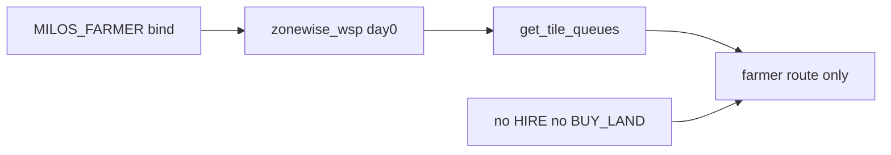

# Farmer-only minimum submit (from [.cursor/logs.txt](.cursor/logs.txt))

## Target architecture



**Not in scope:** milos sandbox code in `milos/` (already has matching geometry in [`milos/zoning.py`](milos/zoning.py)), new solver backend, dawn replan build-out, smoke_analysis changes.

---

## 1. Config switch (master lever) — corrected per logs

**Do not set `CURRENT = FIVE`.** FIVE is **25 tiles / 5 workers** (farmer + hire1–4). That is not the milos farmer-only setup.

Add a **new** `Layout` constant aligned with milos zone I:

| After `bind(MILOS_FARMER)` | Value |
|----------------------------|--------|
| `WORKERS` | `("farmer",)` |
| `HAND_WORKERS` | `()` |
| `NUM_TILES` | `5` |
| `WORKER_TILES` | `{"farmer": (0, 1, 2, 3, 4)}` |
| `NUM_HIRES` | `0` |

### [`agent/zoning.py`](agent/zoning.py)

- Define **`MILOS_FARMER`** `Layout` (name in startup log: **`milos_farmer`**):
  - **`coords`**: same 5 coordinates as FIVE zone I — `FIVE.coords[0:5]` (tiles 0–4 on the NW column snake).
  - **Single zone**: copy `FIVE.zones[0]` (`farmer`, tiles `(0,1,2,3,4)`, `net_tile_ops=18`, `preamble=()`, `is_hand=False`).
  - Same `shed_door` / `shed_adjacent` as other one-land layouts (owned center tiles for pickup).
- Set **`CURRENT = MILOS_FARMER`** (replace `CURRENT = THREE if USE_THREE else TWO`, or optional env gate e.g. `KAGGRI_LAYOUT=milos_farmer` vs legacy TWO for local A/B).
- Do **not** call `_register_land3_catalog()` unless `CURRENT is TWO`.

Mirror for reference (already in repo sandbox): [`milos/zoning.py`](milos/zoning.py) + [`milos/wsp/config.py`](milos/wsp/config.py) `FARMER_TILES`.

### [`agent/solvers/__init__.py`](agent/solvers/__init__.py)

- **`CURRENT_SOLVER = "zonewise_wsp"`** (drop twoland/threeland default from `KAGGRI_LANDS`).

### Day-0 prestart

[`wsp_prestart.json`](agent/solvers/wsp_prestart.json) is 25-tile / 5-worker → **`_is_prestart_solve` will not match** on `MILOS_FARMER`; day-0 runs **5-tile MIP** (same as milos `farmer.solve`). Optional later: slice prestart tiles 0–4 like [`milos/wsp/farmer.py`](milos/wsp/farmer.py) — not required for v1.

### [`agent/planner.py`](agent/planner.py) (minimal)

- **`NUM_ACTIVE_HIRES = 0`** initially.
- **`replan()`**: early **`return`** at top for v1 (avoids TwoLand hire / `BUY_LAND_DAY` paths still in the function).

Steps **2–7** unchanged from prior plan (market, executor, script, smoke, no submit unless asked).

---

## 2. [`agent/market.py`](agent/market.py)

| Change | What |
|--------|------|
| **Hires** | `_target_hires` → **`0`** when `not zoning.HAND_WORKERS`; no `HIRE` orders. |
| **BUY_LAND** | Remove `_ne_owned`, `_sw_owned`, `_land2_owned`, `_next_buy_cost`, dawn `BUY_LAND` insert, `buy_land_reserved` block. |
| **Dead** | Delete `_count_animals_placing_today`, `_needs_build_today`. |

---

## 3. [`agent/executor.py`](agent/executor.py)

Remove: `_preamble_action` (+ call site), `_snapshot_planned_ops`, `_log_hand_eod`, `_log_hand_positions`, `_executed_nonpass` tracking.

---

## 4. Untouched

`sell_dp.py`, `tile_ops.py`, `pricing.py`, `rollouts.py`, `animal_rollouts.py`, `flags.py`, `workers.py`.

---

## 5. [`agent/script.py`](agent/script.py)

Delete `_build_four_tile_queues` and `zoning.FOUR` branch in `_build_tile_queues`.

---

## 6. Verify (local)

```bash
bash scripts/smoke_test.sh
```

Expect: `[zoning] CURRENT=milos_farmer tiles=5 hands=0`, `CURRENT_SOLVER=zonewise_wsp`, no `HIRE` / `BUY_LAND`.

Submit only on explicit request (`scripts/smoke_and_submit.sh --submit "milos_farmer v1"`).

---

## 7. Follow-ups

- Prestart slice for instant day-0 on `MILOS_FARMER`.
- Env toggle to restore TWO/THREE without re-adding deleted market/executor code.
