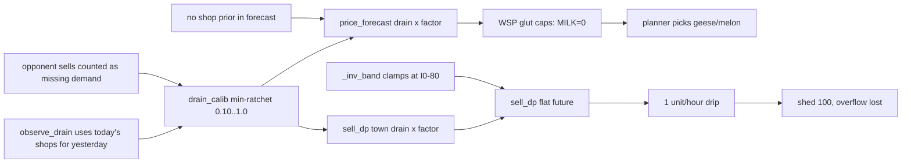

# Fix bearish price forecast and sell hoarding

## Rollout: one flag per step (Sept02 lesson)

Ship all steps in one pass, but **each step is gated by its own env var** (read once at module load or first use; `1` / `true` / unset = **on**, `0` / `false` = **off**). If V55 margin gets worse, bisect by turning flags off without reverting code.

| Flag | Step | When off |
|------|------|----------|
| `KAGGRI_FIX_CALIB` | 1 — kill drain calibrator | Legacy `observe_drain` + `drain_calib.factor(p)` |
| `KAGGRI_FIX_PRIOR` | 2 — expected-shop prior in forecast + sell drain | Today's shops only in `price_forecast`; sell_dp keeps old `town_drain_by_day` prior |
| `KAGGRI_FIX_SELL` | 3 — sell DP band, HOLD_COST, burst sells | Old `_inv_band`, HOLD_COST=2, always `premium_drip=True` |
| `KAGGRI_FIX_FERT` | 4 — late-zone fert + reserve | Current fert pickup / dump behavior only |
| `KAGGRI_FIX_RESET` | 5 — episode reset at step 0 | Module globals carry across games in one process |

Implement a tiny helper in [milos/envconfig.py](milos/envconfig.py) or [milos/fix_flags.py](milos/fix_flags.py): `def fix_enabled(name: str, default: bool = True) -> bool`.

`[fc_err]` logging (Step 6) ships with the forecast changes and has **no separate flag** — it is diagnostic only.

## What the code confirms

Every claim in [.cursor/logs.txt](.cursor/logs.txt) that I could check holds. The bugs stack, and they all push the same way: premiums look worthless.

- [milos/drain_calib.py](milos/drain_calib.py) line 50: `_factors[product] = min(prev, ratio)` is a one-way ratchet capped at 1.0.
- [milos/price_forecast.py](milos/price_forecast.py) `observe_drain` (~300-322): `raw_drain_for_day(unlocked, day - 1)` uses today's shop list for yesterday, so on unlock day the ratio is exactly 2/8 = 0.25. `observed = prev - now` includes the opponent's sells and any wheat buys.
- `build_drain_by_day` (~282) keeps today's shops fixed for the whole horizon, with no shop prior.
- [milos/sell_dp.py](milos/sell_dp.py) `town_drain_by_day` (~120-125): the shop prior skips `PREMIUM_PRODUCTS`, adds demand only on unlock days instead of every day after, and is weighted by `P_NEW_SHOP=0.35`.
- `_inv_band` (~61) clamps `lo` at `I0 - 80`. With strawberry at I0-300, the DP sees the wrong price and a flat future.
- `replan` (~464-471) has the same one-day shop lag in `prev_town`, and `_update_opponent_residual` uses it.
- [milos/market.py](milos/market.py) ~376-386 always passes `premium_drip=True`, so each product sells at most 1 unit per market hour.
- Fertilizer: smoke shows hire7 with 1 FERTILIZE and hire12 with 0, against 9-11 for hire2 and hire5. The gate is in [milos/script.py](milos/script.py) `zone_fert_pickup_needed` (~176) and [milos/tile_ops.py](milos/tile_ops.py) `_may_fertilize_today` (~66).
- Nothing resets module globals (`_factors`, `_opp_ema`, both `_prev_market_inv`, `_schedule`) at step 0, so a second game in the same process inherits the first game's floored factors.

## Step 1: Remove drain calibration (`KAGGRI_FIX_CALIB`)

- When flag on: `drain_calib.factor()` returns `1.0`; no `update` / min ratchet. Keep `note_sells` / `snapshot` as stubs.
- Remove `price_forecast.observe_drain(obs)` from [milos/executor.py](milos/executor.py) ~211 when flag on; slim `[fc]` log (premium inv, no factors).
- Remove `drain_calib.factor(p)` multiplications in `build_drain_by_day` and `town_drain_by_day` when flag on.

The town drain is deterministic from the rules. Opponent supply stays in visible-tile forecast supply and `_opp_ema`.

## Step 2: Shared expected-shop prior (`KAGGRI_FIX_PRIOR`)

When flag on, add [milos/town_drain.py](milos/town_drain.py) and wire both modules:

- Known shops: `shop_demand_by_product(unlocked) * ticks_per_day`, every day.
- Town center: 1x / 2x / 4x schedule by day.
- Future unlocks: for each `u > day` with `u % unlock_interval == 0`, add `locked_demand[p] / n_locked * ticks_per_day` to all days `>= u` — **all products including premiums**. Drop `P_NEW_SHOP` discount.
- Yesterday measurement: store previous dawn `unlocked_shops`; pass that list into `raw_drain_for_day` for residual / observe paths.

## Step 3: Un-clamp sell DP and stop hoarding (`KAGGRI_FIX_SELL`)

When flag on:

- `_inv_band`: `lo = start_inv - INV_PAD_LO`, `hi = start_inv + INV_PAD_HI`, no I0 clamp; `INV_PAD_LO = 120`.
- `_update_opponent_residual`: yesterday's shop list for `prev_town` (pairs with PRIOR when both on).
- [milos/market.py](milos/market.py): `premium_drip=False` when quote ≥ base or `shed_total >= SHED_CAP - 10`; else hourly drip.
- `HOLD_COST = 10`.

## Step 4: Fertilizer for late-activated zones (`KAGGRI_FIX_FERT`)

When flag on:

- `[fert]` trace once per worker/day (profile, age, skip reason).
- Fix replan_after_buy / Walk 2/3 `_with_fert` chains so hire7/hire12 match early zones.
- Fert reserve: floor `FERT_SHED_CAP`, cap against full-horizon need of active `_with_fert` chains.

## Step 5: Per-episode reset (`KAGGRI_FIX_RESET`)

When flag on: `reset_episode()` in `sell_dp`, `price_forecast`, `drain_calib` (+ any other mutable globals); call from [main.py](main.py) `agent()` at `obs["step"] == 0`.

## Step 6: Forecast-error KPI

- Dawn `[fc_err] d=.. product=forecast/actual` for premiums + TOMATO + CARROT.
- `parse_fc_err` in [scripts/smoke_analysis/](scripts/smoke_analysis/) + notebook plot.

## Step 7: Validate

- `SMOKE_RUNS=6 bash scripts/smoke_multi_run.sh` — random track green; V55 alternating seats.
- **Prestart stays unchanged** — day-0 opening will still look geese/melon-heavy. **Do not** use day-0 chain mix as the forecast success metric.
- **Judge forecast fix on d3+ replans** (first shop unlocks land in the log narrative):
  - WSP / planner logs: `MILK` glut caps **> 0** on dawn replans from d3 onward (not necessarily d0).
  - Solver picks: more **cow / strawberry** (and fewer goose-only zones) on **d3+** `replan_after_buy` / Walk 2/3 activations.
  - `[fc_err]`: mean |error| on premiums **< $10/day** from d3 onward.
- Sell / fert (flags 3–4): MILK & STRAWBERRY units sold up vs baseline (33 / 52); shed not at 100 at dawn for 2+ consecutive late-season days; hire7/hire12 FERTILIZE counts near early zones.
- V55 margin: target improvement over ~-101k baseline; if worse, run `KAGGRI_FIX_*=0` one at a time to locate regression.
- Sell-price heatmap: premium sells shift right of 1.0× when SELL fix is on.

## Out of scope

- WSP objective or weights.
- Changing day-0 prestart chains to force cows on d0 (that would mask whether the forecast fix worked).
- Layout / NE buy timing — revisit after PRIOR+CALIB prove out on d3+ caps.
