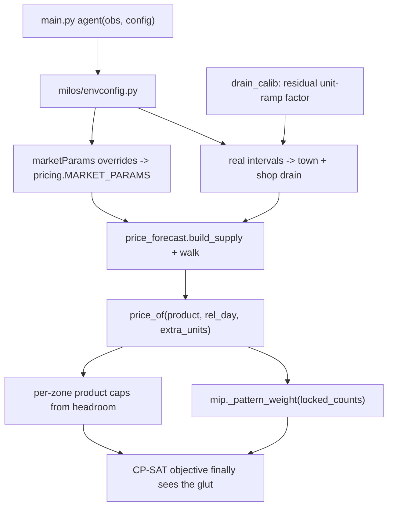

# Fix the price forecast

## Corrected diagnosis

My earlier rebuttal of `.cursor/logs.txt` was wrong, and the turn-by-turn trace settles it. Observed in the replay: WOOL and MELON drain **exactly one tick per day, at hour 1, magnitude -1, for all 30 days including day 20-29**. No second tick, no ramp.

The reason is a **config mismatch, not a modelling subtlety**:

- That episode ran `townCenterSellInterval: 24`. [milos/price_forecast.py](milos/price_forecast.py) hardcodes `TOWN_CENTER_INTERVAL = 12` (and [milos/sell_dp.py](milos/sell_dp.py) repeats it). That alone is a flat 2x overestimate of the town-center sink.
- The day-10/day-20 unit ramp in `_town_center_units` (1 -> 2 -> 4) never fired in that replay either. Combined with the interval error that is up to **8x too much wool demand** from day 20 on.

**The root enabler is that the agent has never been given the configuration at all.** `main.py` declares `agent(obs)`, and kaggle-environments only passes configuration when the callable takes two arguments:

```153:155:/home/wlaki/.local/lib/python3.12/site-packages/kaggle_environments/agent.py
args = args[: agent.__code__.co_argcount]
return agent(*args) if callable(agent) else agent
```

Confirmed in [main.py](main.py): `def agent(obs)` — single argument, so every interval, `turnsPerDay`, and — importantly — `marketParams` (a documented sparse override of `base`/`I0`/`T`/curve shapes per product, which [milos/pricing.py](milos/pricing.py) also hardcodes) has been invisible to us. W2 fixes that at the source, which is strictly better than calibrating around it.

### Shops: duplicates are real, and my v2 claim was wrong there too

The replay trace shows `SMOOTHIE_SHOP` drawn a second time on day 21 and `PET_CAFE` a second time on day 24, while `BAKERY` and `YARN_STORE` were never drawn at all across 8 unlock events. The installed engine's `_end_of_day` filters the pool with `remaining = [s for s in SHOPS if s not in town["unlocked_shops"]]`, which makes that impossible — so the v2 rebuttal was, again, reasoning from a local build that does not match the competition.

**Standing lesson for the whole plan: the locally installed `kaggle_environments` is not ground truth for the competition.** It disagrees with the replay on at least the town-center interval, the town-center ramp, and shop-unlock dedupe. Local smokes verify our code does what we intend; only replays and the `[cfg]` log verify what the competition actually runs.

Two consequences:

1. **Yarn Store — the only shop demanding wool — never unlocked.** That removes the last confound: wool really was town-center-only for all 30 days, at 1/day.
2. **Nothing may assume `unlocked_shops` is distinct.** `rollouts.shop_demand_by_product` happens to be correct already (it iterates the list, so a duplicate doubles that shop's demand, matching the engine's own per-entry loop), but `sell_dp.town_drain_by_day` derives its locked pool set-wise and then credits speculative future demand from it — which silently assumes `YARN_STORE` will eventually unlock. Given re-draws, that is exactly the optimism that let wool look valuable. Addressed as a W2 sub-item.

Two other bugs are independent of all this and still stand:

- **A hard crash.** `OPP_CROP_PROFILE = "with_fert"` in [milos/price_forecast.py](milos/price_forecast.py), but `MELON` only has `no_fert` in `data/crop_rollouts.json`. Any opponent melon tile raises `KeyError: 'with_fert'` (the `forecast failed d=13: 'with_fert'` in the last smoke), and `_safe_price_of` then falls back to I0 base prices — wool $200, melon $250 — maximum optimism exactly when the market is glutted.
- **Self-impact is switched off.** [milos/wsp/mip.py](milos/wsp/mip.py) stamps `daily_harvest` per pattern, defines `_glut_price_factor`/`_glut_unit_price`, and `twoland.solve` accumulates `locked_harvest` across zones and passes it as `locked_counts` — then `_pattern_weight` does `del locked_counts`. Every sheep is valued at full $200/wool no matter how many are already planned. `.cursor/plans/daily_price_forecast_51889f79.plan.md` dropped it on the grounds that the forecast already prices supply, but `build_supply` only counts **frozen** tiles, never the solver's own candidates.

Scale, using the corrected 1/day sink: ~30 wool absorbed per season, shared with the opponent. One cared sheep yields 34. `quoted("WOOL", 10000+d) = 200 - 0.058*d^2` hits $1 near d=58. The replay ended at inv 10058, price 1, holding 49 unsold wool.



One git commit per wave, in order. Do not submit to Kaggle.

## W1: stop the crash and the optimistic fallback

[milos/price_forecast.py](milos/price_forecast.py) — make `_add_profile_harvests` tolerate a missing profile instead of raising. It is the single choke point for both `_collect_frozen_supply` and `_stamp_live_tile_harvests`:

```python
def _resolve_profile(label, profile_name, crops_data, animals_data) -> str | None:
    spec = crops_data["crops"].get(label) or animals_data["animals"].get(label)
    if spec is None:
        return None
    if profile_name in spec:
        return profile_name
    for alt in ("with_fert", "no_fert", "with_care", "no_care"):
        if alt in spec:
            return alt
    return None
```

Call it at the top of `_add_profile_harvests`; return early when it yields `None`.

[milos/planner.py](milos/planner.py) — `_safe_price_of` must fall back to **current market quotes**, not `wsp_data.i0_base_prices()`, and log loudly:

```python
except Exception as exc:
    print(f"[fc] FORECAST FAILED d={day}: {type(exc).__name__}: {exc}", flush=True)
    inv = (obs.get("market") or {}).get("inventory") or {}
    snap = {p: int(inv.get(p, pricing.I0_DEFAULT)) for p in pricing.MARKET_PARAMS}
    return lambda product, rel_day=0, extra_units=0, _i=snap: pricing.quoted(
        product, _i.get(product, pricing.I0_DEFAULT) + int(extra_units)
    )
```

## W2: read the real episode config

[main.py](main.py) — widen the entry point so kaggle-environments actually hands us the configuration. `co_argcount` must be 2; the default keeps local direct calls working:

```python
def agent(obs, config=None):
    envconfig.ingest(config)
    return _step(obs)
```

New `milos/envconfig.py` — a tiny module-level store, ingested once and read everywhere:

- `ingest(config)` — idempotent; tolerates `None`, a dict, or the `Struct` kaggle passes. Reads `turnsPerDay` (24), `townCenterSellInterval` (12), `townShopSellInterval` (4), `townShopUnlockInterval` (3), `maxMarketOrdersPerTurn` (10), `shedCapacity` (100), `marketParams` ({}).
- Accessors `turns_per_day()`, `town_center_interval()`, `shop_interval()`, etc., each falling back to today's hardcoded default when config was never supplied.
- On first ingest, log once so the next Kaggle submission answers whether `townCenterSellInterval: 24` is episode-specific or competition-wide:
  `[cfg] turnsPerDay=24 townCenterSellInterval=24 townShopSellInterval=4 townShopUnlockInterval=3 maxMarketOrders=10 shedCap=100 marketParams={...}`

Replace the hardcoded constants:

- [milos/price_forecast.py](milos/price_forecast.py): `SHOP_INTERVAL`, `TOWN_CENTER_INTERVAL`, and the `24 /` scale factors in `shop_drain_per_day` and `town_drain_per_day` become `turns_per_day() / shop_interval()` and `turns_per_day() / town_center_interval()`.
- [milos/sell_dp.py](milos/sell_dp.py): same for `SHOP_INTERVAL`, `TOWN_CENTER_INTERVAL`, `SHOP_UNLOCK_INTERVAL` in `_known_shop_drain` / `_town_center_drain` / `town_drain_by_day`, and `SHED_CAP` from `shedCapacity`.
- [milos/pricing.py](milos/pricing.py): apply `marketParams` as a sparse overlay onto `MARKET_PARAMS`, mirroring `_resolve_market_params` in the engine (keys `base`, `I0`, `T`, `below_func`, `below_target`, `above_func`, `above_target`; the engine also supports a `log10` curve, which `_f` currently does not). Clear the `_sell_prefix_table` `lru_cache` after an overlay so cached revenue tables cannot go stale.

Leave `_town_center_units` as-is for now: the ramp is **not** config-driven in the engine source, so W5 has to handle it.

### W2b: stop assuming distinct shops

- Audit `rollouts.shop_demand_by_product` and keep it counting **by list entry, not membership** — it is already correct, so this is a regression guard plus a short comment recording why (the engine loops per entry, and duplicates do occur).
- [milos/sell_dp.py](milos/sell_dp.py) `town_drain_by_day`: `locked = [s for s in _ALL_SHOPS if s not in unlocked]` then credits `locked_demand * (turns_per_day / shop_interval) / n_locked` on unlock days. Because a draw can repeat an already-unlocked shop, the probability of actually gaining a *new* shop is well below 1. Discount that speculative term by an explicit `P_NEW_SHOP` constant, and drop it entirely for `GLUT_PRODUCTS` — under-crediting a premium sink is the safe direction, since the failure mode is over-production.
- Log once per dawn alongside `[cfg]`: `[shops] d= raw=8 distinct=6 dupes=SMOOTHIE_SHOP,PET_CAFE missing=BAKERY,YARN_STORE` so future smokes and replays surface this instead of assuming it cannot happen.

Verification for this wave: run one smoke with `townCenterSellInterval=24` forced via `make("kaggriculture", configuration={...})` and confirm the `[cfg]` line and that modelled wool drain drops to 1/day for days 0-9. Note that the local engine will never produce duplicate shops, so the `[shops]` line can only be exercised with a synthetic `unlocked_shops` list in a unit-style check or observed on a real replay.

## W3: inventory-aware `price_of`

[milos/price_forecast.py](milos/price_forecast.py):

- Split `walk_prices` into `walk_prices_and_inv(...) -> (prices, invs)` that also records the pre-sell inventory per day; keep `walk_prices` as a one-line wrapper so `experiments/` notebooks keep working.
- `make_price_forecast` keeps both tables and widens the signature. Existing 2-arg callers are unaffected:

```python
def price_of(product: str, rel_day: int = 0, extra_units: int = 0) -> int:
    rel = 0 if rel_day < 0 else min(rel_day, len(table) - 1)
    if extra_units <= 0:
        return table[rel].get(product, _fallback(product))
    base_inv = inv_table[rel].get(product)
    if base_inv is None:
        return table[rel].get(product, _fallback(product))
    return pricing.quoted(product, base_inv + int(extra_units))
```

- The `horizon <= 0` `flat` closure takes `extra_units` too.

Add `extra_units=0` to every fallback price lambda so the solver can call them uniformly: [milos/planner.py](milos/planner.py) L90 (`build_day0`) and L425 (`make_price_of`), [milos/wsp/farmer.py](milos/wsp/farmer.py) L96, [milos/wsp/oneland.py](milos/wsp/oneland.py) L88, [milos/wsp/twoland.py](milos/wsp/twoland.py) L94.

## W4: reconnect self-impact

[milos/wsp/mip.py](milos/wsp/mip.py) — price each pattern's units on the real curve, walking up from what earlier zones already booked:

```python
def _pattern_weight(pat, locked_counts, price_of) -> int:
    counts = dict(locked_counts or {})
    rev = 0
    for product, hday, yld in pat["harvest_lines"]:
        n = counts.get(product, 0)
        for _ in range(int(yld)):
            rev += price_of(product, hday, n)
            n += 1
        counts[product] = n
    return rev - pat["setup_cost"]
```

Cost is roughly 500 patterns x ~30 unit calls per zone — negligible. Delete the now-unused `_glut_price_factor`, `_glut_unit_price` and the `count_div` entries in `GLUT_CAPS`; keep `GLUT_PRODUCTS` as the cap list. Leave `_stamp_placement`'s `cash_by_day` at full price: patterns are built once and shared across zones, so it cannot depend on `locked_counts`. It only feeds the cash-flow feasibility constraint, and it stays optimistic exactly as today.

`locked_counts` must stay "newly planned units only" — frozen and locked supply is already inside `inv_table` via `build_supply`, so seeding it would double-count.

Within one zone the MIP still cannot see its own tiles stacking, so add a linear cap. `solve_zone` gains `product_caps: dict[str, int] | None = None`:

```python
for product, cap_units in (product_caps or {}).items():
    terms = [
        x[pi, tile] * pat["harvest_units"][product]
        for pi, pat in enumerate(patterns)
        if pat["harvest_units"].get(product, 0) > 0
        for tile in zone_empty
    ]
    if terms:
        model.Add(sum(terms) <= cap_units)
```

[milos/wsp/twoland.py](milos/wsp/twoland.py) and [milos/wsp/oneland.py](milos/wsp/oneland.py) — compute caps per zone from remaining headroom before the price crosses half of base, binary-searching the (monotone) `price_of`:

```python
def _glut_headroom(product, price_of, horizon, already, floor_ratio=0.5, limit=400):
    floor = pricing.price_floor(product, floor_ratio)
    rel = min(max(0, horizon // 2), horizon - 1)
    lo, hi = 0, limit
    while lo < hi:
        mid = (lo + hi + 1) // 2
        if price_of(product, rel, already + mid - 1) >= floor:
            lo = mid
        else:
            hi = mid - 1
    return lo
```

Pass `product_caps={p: _glut_headroom(p, price_of, horizon, locked_harvest.get(p, 0)) for p in GLUT_PRODUCTS}` into each `mip.solve_zone` call, and log `[fc] caps d= zone= WOOL= MILK= MELON= STRAWBERRY=`.

## W5: runtime calibration of what config cannot tell us

After W2 the intervals are exact, so the only remaining unknown is the **town-center unit ramp** (`_town_center_units`), which is not config-driven in the engine source yet demonstrably did not fire in the replay. Worst case that is a 4x overestimate from day 20, so the clamp floor must be **0.1, not 0.2** — at 0.2 wool would stay overpriced by ~1.6x even after convergence.

New `milos/drain_calib.py` — a dumb state container, no imports from `price_forecast` (one-way dependency, no cycle):

- `note_sells(orders)` — accumulate `SELL` quantities.
- `update(product, observed, modelled)` — `factor[p] = max(existing, clamp(observed / modelled, 0.1, 1.0))`.
- `factor(product) -> float` — defaults to `1.0` when there is no evidence yet.
- `snapshot() -> str` for logging.

Only **clean days** count: days where we sold zero of that product. Then the observed drop `prev_inv - cur_inv` is a valid lower bound on real drain, since opponent sells only push inventory up. Taking the running max keeps the tightest valid bound; capping at 1.0 means the calibrator can only ever shrink the modelled drain, never inflate it — correct here, because after W2 the only residual error is the ramp, which can only make the model too big.

[milos/price_forecast.py](milos/price_forecast.py):

- Extract `raw_drain_for_day(unlocked_shops, abs_day) -> dict[str, float]` from `build_drain_by_day`.
- `build_drain_by_day` multiplies each row by `drain_calib.factor(p)`.
- Add `observe_drain(obs)` that diffs the stored dawn inventory against today's, and calls `drain_calib.update(...)` with `raw_drain_for_day(unlocked, day - 1)`.

[milos/sell_dp.py](milos/sell_dp.py) — apply the same factor in `town_drain_by_day` so the sell DP and the planner agree on the sink.

[milos/executor.py](milos/executor.py) — at `hour == 0`, before `planner.replan(...)`:

```python
try:
    price_forecast.observe_drain(obs)
except Exception as exc:
    _log(f"[fc] drain observe failed d={day}: {exc}")
```

[milos/market.py](milos/market.py) — at the end of `build_orders`, after the `MAX_ORDERS` truncation, `drain_calib.note_sells(orders)` so only orders we actually submit are counted.

Log once per dawn: `[fc] d= drain=WOOL:0.25,MILK:1.00,... wool_now= wool_mid= melon_now=`.

## Verify (local only, no submit)

3 unseeded `scripts/smoke_test.sh` runs plus one run with `townCenterSellInterval=24` forced, compared as a distribution against the current baseline of 140059 / 131205 / 144867:

- zero `FORECAST FAILED` lines (W1)
- `[cfg]` line prints the resolved config; the forced run shows `townCenterSellInterval=24` and halved wool drain (W2)
- `[shops]` line prints raw vs distinct counts; a synthetic duplicated `unlocked_shops` doubles that shop's demand rather than dropping it (W2b)
- final `WOOL` market inventory well under +58, and wool never parked at $1 for long stretches (`[snap] ... WOOL=`)
- `[fc] caps` shows a shrinking wool cap as zones cascade (W4)
- `[fc] drain` factors settle; wool near 0.25 from day 20 confirms the ramp does not fire (W5)
- no `land_fail`, `walk1/walk2 failed`, `replan failed`; solve time per dawn unchanged

Open questions to answer from the next submission's `[cfg]` and `[shops]` logs, since the local engine cannot settle either: whether `townCenterSellInterval: 24` is competition-wide, and whether shop re-draws are systematic. If the interval is competition-wide, W5's calibrator becomes a safety net rather than the primary correction, and we could consider hardcoding the observed flat ramp instead. If re-draws are systematic, `P_NEW_SHOP` should be fit from replays rather than guessed.

If total coins regress, the first knobs are `floor_ratio` in `_glut_headroom` (0.5 -> 0.35) and the `0.1` clamp floor.
