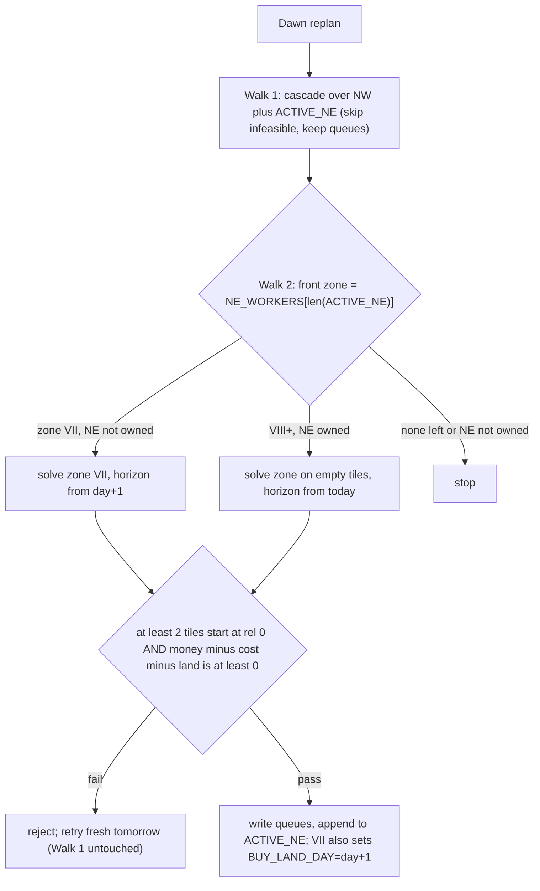

# NE-land: minimal trigger plus NW-mirrored execution

## Daily flow

## 1. Layout in [milos/zoning.py](milos/zoning.py)
- Add a new `MILOS_TWOLAND12` layout and leave `MILOS_ONELAND6` unchanged. Its coords are `_ONELAND_COORDS` plus `_column(5..9)`, so NE indices run 25–49 (doc tile 26 is index 25, at (5,4)).
- Add the NE zones in **activation order** (VII, VIII, IX, X, XI, XII). This order keeps the `bind()` fib costs aligned with the real hire order (8, 13, 21, 34, 55, 89).
  - `hire6` VII: tiles `(25,26,27,28,29)`, cap 17
  - `hire10` VIII: tiles `(30,31,32,33)`, cap 15
  - `hire9` IX: tiles `(35,36,37,38)`, cap 15
  - `hire8` X: tiles `(40,41,42,43)`, cap 14
  - `hire7` XI: tiles `(45,46,47,48)`, cap 14
  - `hire11` XII: tiles `(34,39,44,49)`, cap 12
  - Every NE zone uses `preamble=("PICKUP",)` and `start_hour=1`.
- **Spawn caveat:** because NE hands are hired gradually, spawn corners differ from the doc's six-hire layout. So NE hands skip the blind snake moves. `PICKUP` walks to the nearest owned shed tile, and `_step_toward` then walks the doc tile order. The ops caps are exactly the doc values, with no +1.
- Export `NW_WORKERS`, `NE_WORKERS` (activation order) and `NE_TILES`, and set `CURRENT = MILOS_TWOLAND12`.

## 2. Solver scope in [milos/wsp/oneland.py](milos/wsp/oneland.py)
- Add a `workers: tuple[str, ...] | None = None` parameter to `solve` and loop over it instead of `WORKERS`. Without this, inactive NE hands get charged `HAND_DAILY_COST` through `_locked_conservative_handoff`.
- Make `_is_prestart_solve` compare against the tiles of the workers passed in.
- `build_day0` in [milos/planner.py](milos/planner.py) passes only the NW tiles, counts and workers, so `prestart.json` still loads.

## 3. Planner in [milos/planner.py](milos/planner.py)
- Set `NUM_ACTIVE_HIRES = len(NW hands)`, which is 5. It currently equals `NUM_HIRES`, which would become 11.
- Add `ACTIVE_NE: list[str] = []` and `active_workers() = NW_WORKERS + ACTIVE_NE`.
- Implement `is_buy_morning_locked`, which is stubbed today: it returns true when `tile == "LOCKED"`, `day == BUY_LAND_DAY` and `idx in NE_TILES`. The existing `tile_ops`, `market._tile_empty` and `_dawn_empty` checks then treat NE tiles as empty on buy morning.
- Split `replan()` into two walks:
  - **Walk 1** keeps the current logic, restricted to `active_workers()`. It filters `replan_tiles` to active-zone tiles and passes `workers=active_workers()`. The current `any_replan_eligible` early return must skip only Walk 1, not Walk 2.
  - **Walk 2** is a new `_activate_next_ne(obs, tile_queues, tile_state, price_of)` function:
    - Take the front zone from `NE_WORKERS[len(ACTIVE_NE)]`.
    - For zone VII while NE is unowned, use `offset=1` and `land=1000`. For zone VIII onward, first require `"NE" in me["unlocked_quadrants"]`, then use `offset=0` and `land=0`, and plan only the zone's `None`/WEED tiles.
    - Call `solve(..., workers=(w,), horizon=NUM_DAYS-(day+offset), starting_money=money-land, track_shed=False, charge_hire_daily=True)`.
    - Busy gate (user decision): at least 2 chains have their first start at 0, meaning the activation day. Log both `busy_day0` and `busy_any` (tiles with any non-empty chain) on every accept and reject. The reviewer warned that this is the old `NEW_ZONE_MIN_DAY0_STARTS` shape (`two_land_fails.md` §7): a staggered solve could be rejected every day. If smoke shows repeated rejects with `busy_any >= 2`, switch the gate to `busy_any`, which is a one-line change.
    - Cash gate: `money - cost - land >= 0`. Here `cost` is the negated `spend_by_day` total from `replan_lock._stamp_chain` summed over the chains, plus `HAND_DAILY_COST[w] * horizon`.
    - On a pass, write the queues through `chain_to_queue_items` with starts shifted by `offset`. For zone VII, `tile_state["lag"] = first_lag + offset`, which offsets the next dawn's decrement. Then append to `ACTIVE_NE`, and for VII set `BUY_LAND_DAY = day + 1`.
    - On a fail, log `[ne] reject d=.. zone=.. busy=.. cost=..` and return. Tomorrow's solve starts from scratch.
- Housekeeping: clear `BUY_LAND_DAY` once `day > BUY_LAND_DAY`. If NE is still unowned after the buy day, roll back: clear the VII queues and set `ACTIVE_NE = []`.
- Hire-landed rollback for every NE zone, not just VII:
  - The executor records the NE workers that actually get bound each day in `planner.NE_BOUND_TODAY`.
  - At the next dawn, before Walk 1, pop from `ACTIVE_NE` any zone that was active yesterday but never bound. Clear its tiles that are still untouched (`queue_idx == 0` and the tile is `None`/LOCKED), and log `[ne] rollback`.
  - This covers a silently rejected h=1 `HIRE` after Walk 1 spent the cash, which would otherwise strand tiles the way Fix #4 did.
  - Do not roll back when the hire landed but there was nothing to do, since zones with fully locked tiles are still in `ACTIVE_NE`.

## 4. Market in [milos/market.py](milos/market.py)
- At h=0 on `BUY_LAND_DAY`, insert `["BUY_LAND"]` at position 0 and subtract 1000 from `money`/`spendable` before the wheat, animal and seed buys. The NE seeds and animals get bought at h=0 through the existing `needed_buys`, since the queues exist and `is_buy_morning_locked` is now true.
- At h=1, if NE is owned and `day <= SEASON_LAST_DAY`, prepend `len(planner.ACTIVE_NE)` `["HIRE"]` orders.
- Order overflow: on buy morning h=0 can hold 5 `HIRE` + `BUY_LAND` + wheat + up to 3 animals + NW and VII seeds, which is more than `MAX_ORDERS=10`, and `orders[:MAX_ORDERS]` silently drops the tail.
  - Run the existing buy block at `hour in (0, 1)` instead of only `hour == 0`. `needed_buys` recomputes deficits against live seeds and shed, so h=1 only buys the leftovers. This is the doc's "h=0-1" market window.
  - At h=1 the NE `HIRE` orders go first, then the leftover buys.
  - When anything gets truncated, log `[market] overflow d=.. h=.. dropped=..`.

## 5. Executor in [milos/executor.py](milos/executor.py)
- In `_claim_worker`, map slots `>= planner.NUM_ACTIVE_HIRES` to `planner.ACTIVE_NE[slot - NUM_ACTIVE_HIRES]` by slot, not position, and add the bound worker to `planner.NE_BOUND_TODAY`.
  - The NW position and `TWOFOLD_HIRE` logic stays unchanged.
  - Binding by slot also covers the doc's duplicate and twofold spawns for hire6 and hire11. No NE worker depends on its spawn corner.
- Fix a bug in `_on_new_day`: `elif not empty: st["active"] = True` marks LOCKED tiles as active. On unlock that fires `on_lifecycle_end` and skips queue item 0. Change it to `elif isinstance(tile, dict)`.

## 6. Verify (local only, no submit)
- Run `scripts/smoke_test.sh` and check the logs:
  - `[ne]` accept and reject lines
  - `BUY_LAND` at h=0 of `BUY_LAND_DAY`
  - h=1 `HIRE` count equal to `len(ACTIVE_NE)`
  - `[bind] slot5=hire6`, with every NE slot bound and none showing `unbound`
  - NE tiles planted on the buy day
  - `[ne] reject` lines: check `busy_day0` against `busy_any`
  - no `[market] overflow` on buy morning, or if there is, the leftovers get bought at h=1
  - no `[ne] rollback` in the normal case
  - no NW regression

## Known simplifications
- The cash gate uses live dawn money and does not chain onto Walk 1's conservative cascade. If that goes wrong, the hire-landed rollback catches it.
- Hardcoding `NUM_ACTIVE_HIRES = 5` is safe: in `milos/`, `DEAD_HANDS` is defined but never read, and `NUM_ACTIVE_HIRES` is only used for the h=0 HIRE loop and in logs.
- NE preambles are `PICKUP` only rather than the literal doc snakes, which costs at most a move or two.