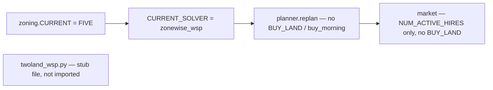

# One-land: strip twoland_wsp / TWO runtime wiring

## Target state



**Keep:** [`agent/solvers/zonewise_wsp.py`](agent/solvers/zonewise_wsp.py), [`agent/solvers/wsp_prestart.json`](agent/solvers/wsp_prestart.json) (25-tile day-0), `planner.NUM_ACTIVE_HIRES` + `_active_hand_hires` + market `_hire_batches` / `_target_hires` (dynamic 4-hand ramp on FIVE), executor/snake, marginal pricing, opponent-aware replan — everything that is not land-2-specific.

**Keep file, no backend:** [`agent/solvers/twoland_wsp.py`](agent/solvers/twoland_wsp.py) — add a one-line module docstring only (valid empty module); **do not** register in [`agent/solvers/__init__.py`](agent/solvers/__init__.py).

**Keep catalog:** [`agent/zoning.py`](agent/zoning.py) `TWO` `Layout` definition; **`CURRENT = FIVE`** (already set).

---

## 1. [`agent/solvers/__init__.py`](agent/solvers/__init__.py)

- Remove `twoland_wsp` import and `_BACKENDS["twoland_wsp"]`.
- `_wsp_solver()`: return `CURRENT_SOLVER == "zonewise_wsp"` only.
- `solve()`: drop `land_owned` / `buy_morning` parameters and the `CURRENT_SOLVER == "twoland_wsp"` kwargs branch.
- `apply_replan()`: drop `write_all_solved` and the twoland-only dispatch branch; always `return _backend().apply_replan(...)`.
- Comment on `CURRENT_SOLVER` line: one-land default `zonewise_wsp` (already set).

---

## 2. [`agent/solvers/types.py`](agent/solvers/types.py)

- Remove `buy_land: bool = False` from `SolveResult` (nothing sets it after strip).

---

## 3. [`agent/planner.py`](agent/planner.py)

Remove imports: `LAND1_TILE_COUNT`, `LAND1_WORKERS`.

Remove module globals / helpers used only for two-land:

- `BUY_LAND_DAY`
- `_land2_owned()`

**`replan()`** simplify to zonewise one-land shape:

| Remove | Replace with |
|--------|----------------|
| `land_owned`, `buy_morning` | — |
| `if not buy_morning and not any(...)` early return | `if not any(_replan_eligible(...))` over `range(NUM_TILES)` |
| `buy_morning` NE tile injection loop | — |
| `hire_target = NUM_ACTIVE_HIRES if (land_owned or buy_morning) else 4` | `hire_target = NUM_ACTIVE_HIRES` |
| `replan_max_time` 5.0 twoland probe branch | always `15.0` |
| `land_owned` / `buy_morning` passed to `solvers.solve()` | omit |
| `result.buy_land` → set `BUY_LAND_DAY` | — |
| `if buy_morning or land_owned:` before `NUM_ACTIVE_HIRES` update | always run `_active_hand_hires` after farmer-ok path (same as today when cascade succeeds) |
| split `apply_replan` (land1 filter + `write_all_solved`) | single `solvers.apply_replan(result, replan_tiles, ...)` |

**`_build_from_solver()`:** delete `if solvers.CURRENT_SOLVER == "twoland_wsp":` land1-only branch; always:

```python
empty_tiles = list(range(NUM_TILES))
empty_counts = {w: len(WORKER_TILES[w]) for w in WORKERS}
```

**`get_tile_queues()`:** change hard-fail from `zoning.CURRENT in (zoning.FIVE, zoning.TWO)` to `zoning.CURRENT is zoning.FIVE` (or `== FIVE`).

---

## 4. [`agent/market.py`](agent/market.py)

- Remove `_land2_owned()`.
- **`_target_hires`:** `return planner.NUM_ACTIVE_HIRES` (drop NE / `BUY_LAND_DAY` branches).
- **`build_orders`:** remove h=0 `BUY_LAND` insert block (lines ~229–235).
- Keep `_hire_batches` / h=0,h=1 HIRE logic (works for 4 hands on FIVE).

---

## 5. [`agent/zoning.py`](agent/zoning.py)

- **Keep** full `TWO = Layout(...)` block.
- **Remove** module-level `LAND1_TILE_COUNT`, `LAND1_WORKERS`, `LAND2_WORKERS` (only twoland glue; no other agent imports after planner cleanup).

---

## 6. [`agent/solvers/twoland_wsp.py`](agent/solvers/twoland_wsp.py)

- Stub only, e.g. `"""Reserved placeholder; live one-land uses zonewise_wsp."""`

---

## Out of scope (per request)

- `.cursor/memory/*`, `docs/*`, notebooks, `scripts/replay_analysis` BUY_LAND KPI lines (harmless if never bought).
- Do not delete `data/two_lands.md` or `TWO` layout geometry.
- No smoke/submit unless you ask after ACT.

---

## Verify after ACT

```bash
rg 'twoland_wsp|BUY_LAND_DAY|buy_morning|buy_land|LAND1_|LAND2_|_land2_owned' agent/
python3 -c "from agent.solvers import solve, CURRENT_SOLVER; print(CURRENT_SOLVER)"
```

Expect zero matches in `agent/` except the stub docstring in `twoland_wsp.py`. Import may need your usual venv if ortools/pandas env is broken on system python.
