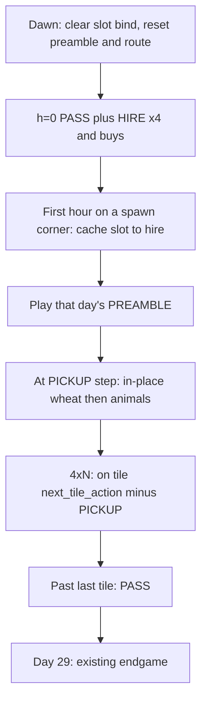

# OneLand — 5 zones from farmer-only

Repo is back to **farmer-only** ([`milos/zoning.py`](milos/zoning.py) `CURRENT = MILOS_FARMER`, [`milos/wsp/oneland.py`](milos/wsp/oneland.py) empty, executor hands PASS). Implement [docs/milos_agent/oneland_claude.md](docs/milos_agent/oneland_claude.md) with two clarifications:

- **HIRE ×4 every dawn** — hands are gone at h=23; re-hire all four at h=0. Identity is still spawn-tile that morning, not HIRE order.
- **Do not edit** [`data/animal_with_pickups.json`](data/animal_with_pickups.json) and **do not strip PICKUP inside MIP** [`milos/wsp/mip.py`](milos/wsp/mip.py). Executor (and replan-lock *remaining tile work*) treat PICKUP as the **shed preamble**, not a later tile verb.

Do **not** touch [`milos/wsp/farmer.py`](milos/wsp/farmer.py). No `BUY_LAND`. No tests/submit.

## Layout — [`milos/zoning.py`](milos/zoning.py)

Add `MILOS_ONELAND` next to `MILOS_FARMER`. Zone order `(farmer, hire1, hire2, hire3, hire4)` so `bind()` fib hire costs stay **1+1+2+3 = 7**.

- Coords 25 tiles: farmer `(4,y)` 0–4; hire1 `(0,y)` 5–9; hire2 `(1,y)` 10–14; hire3 `(2,y)` 15–19; hire4 `(3,y)` 20–24. Ops **18 / 14 / 14 / 15 / 15**.
- Preamble tokens (qty resolved at runtime): hire1 `PICKUP, W,W,W,W`; hire2 `W, PICKUP, W,W,W`; hire3 `N, PICKUP, W,W`; hire4 `W, N, PICKUP, W`; farmer `()`.
- `SPAWN_TO_HIRE`: `(4,4)→hire1`, `(5,4)→hire2`, `(4,5)→hire3`, `(5,5)→hire4`.
- `CURRENT = MILOS_ONELAND`. Print bind line with tile/hand counts.

[`milos/workers.py`](milos/workers.py): spawn-corner helper + `inventory_index(..., hand_slot=)` (slot+1). Do **not** map `hands[i] → hire{i+1}`.

[`milos/planner.py`](milos/planner.py): `NUM_ACTIVE_HIRES = 4`, `CURRENT_SOLVER = "milos_oneland"`.

## Solver — new [`milos/wsp/oneland.py`](milos/wsp/oneland.py)

Same shape as farmer, cascade:

- `build_day0` / prestart: `farmer._load_prestart_raw()` **unscoped** (all 25 keys; JSON already has `solved_workers` hire1–4).
- `solve()`: loop `zoning.WORKERS`. Per worker `mip.solve_zone(..., empty_tiles=WORKER_TILES[w] ∩ empty, locked=locked_by_worker.get(w) or empty, opening=[running_money]*horizon, worker=w, net_tile_ops=NET_TILE_OPS[w])`. **INFEASIBLE → skip that zone, keep queue, continue.** Advance `running_money` from that zone’s conservative close. Hire zones: subtract `HAND_DAILY_COST` in the MIP cash path if `solve_zone` already supports it; otherwise fold into opening/min_balance the same way agent zonewise did.
- Planner imports `from milos.wsp.oneland import solve`. Leave `milos.wsp.__init__` `solve` → farmer for the sandbox.

## Planner / lock (the silent 5-tile bug)

[`FARMER_TILES`](milos/zoning.py) is **frozen to MILOS_FARMER 0–4** and does **not** follow `CURRENT`. Unscope:

- `empty_board` / `apply_solver_result` / `merge_wsp_plan` default / `build_day0` empties → `range(NUM_TILES)`
- `empty_counts` → `{w: len(WORKER_TILES[w]) for w in WORKERS}` (replan: count that worker’s eligible tiles)
- `replan()`: `if day < 2: return` (first live replan day=2)
- [`milos/replan_lock.py`](milos/replan_lock.py): `locked_by_worker` keyed by **all** `zoning.WORKERS` via `worker_for_tile(idx)`, not `{FARMER: ...}`. When stamping locked remaining actions for animals, **do not count PICKUP as on-tile remaining work** (shed already did it). Leave MIP pattern `len(acts)` including PICKUP.

## Market

[`milos/market.py`](milos/market.py) already iterates `NUM_TILES`. At every `hour==0` before last day: **`["HIRE"]` × (4 − current hands)** first (full 4 after overnight wipe), then existing wheat → animals → seeds. [`script.total_wheat_feed_need`](milos/script.py) already sums `WORKERS`; after bind that is all 5 zones. Confirm wheat buy uses that sum vs shed.

## Executor — daily spawn snake

Game: farmer + hands **respawn on a shed corner each dawn**. Hands must be re-hired.

[`milos/executor.py`](milos/executor.py) today: `_farmer_action` + hands always PASS. Change to per-worker (keep farmer tile-op / endgame helpers):

- **Bind once per day** at first sighting on a spawn corner; never re-derive from later position. Log + PASS that slot if not on a corner at bind time.
- **Replay preamble every dawn** (literal W/N; `PICKUP` only while on owned shed). Wheat qty = zone animals fed today; then animal units for today’s PLACE. Repeat PICKUP in place until need met or shed empty; **no walk-to-shed** if the scripted step is off-shed (log + skip).
- Then `WORKER_ROUTES` south→north. On tile: `next_tile_action` but **skip PICKUP** (already done). When no tile work, emit the next scripted step only (`NORTH` between column tiles). No free `_step_toward` to other tiles, no wrap, no extra shed detour. After last tile: PASS until next dawn.
- Farmer: empty preamble; pickup-if-needed on `(4,4)` before leaving tile 0; then 4×N.
- Day 29: keep `_endgame_action`.
- Inventory follows **env hand slot**, not hire label.

## Check

`scripts/smoke_test.sh` only (no Kaggle). Expect 4 hands after each dawn h=0, preamble then column work on days 1–28, no mid-column `PICKUP` / `->shed` before day 29.
