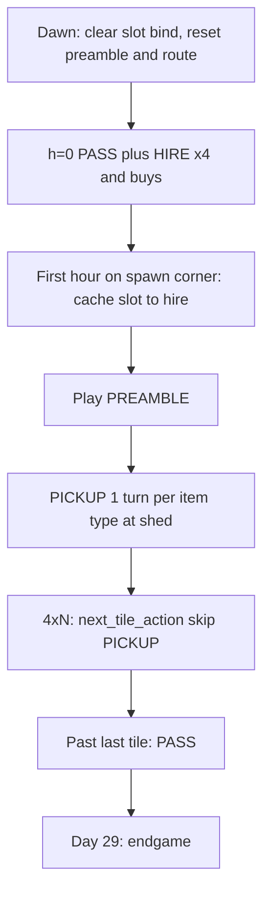

# OneLand — 5 zones from farmer-only

Repo is back to **farmer-only** ([`milos/zoning.py`](milos/zoning.py) `CURRENT = MILOS_FARMER`, [`milos/wsp/oneland.py`](milos/wsp/oneland.py) empty, executor hands PASS). Follow [docs/milos_agent/oneland_claude.md](docs/milos_agent/oneland_claude.md) and [.cursor/logs.txt](.cursor/logs.txt).

Clarifications that stay:

- **HIRE ×4 every dawn** — hands are gone at h=23; re-hire all four at h=0. Identity is spawn-tile that morning, not HIRE order.
- **Do not edit** [`data/animal_with_pickups.json`](data/animal_with_pickups.json).
- **Do touch** [`milos/wsp/mip.py`](milos/wsp/mip.py) — the earlier “leave MIP `len(acts)` including PICKUP” line was **wrong**. Confirmed: `_stamp_placement` does `daily_tile_ops[cal] += len(acts)` including `"PICKUP"`, and `solve_zone` sums that into `<= net_tile_ops`. Three animals feeding the same zone-day currently charge **3** ops for one `PICKUP WHEAT n`.

Do **not** touch [`milos/wsp/farmer.py`](milos/wsp/farmer.py). No `BUY_LAND`. No tests/submit.

## Layout — [`milos/zoning.py`](milos/zoning.py)

Add `MILOS_ONELAND` next to `MILOS_FARMER`. Zone order `(farmer, hire1, hire2, hire3, hire4)` so `bind()` fib hire costs stay **1+1+2+3 = 7**.

- Coords 25 tiles: farmer `(4,y)` 0–4; hire1 `(0,y)` 5–9; hire2 `(1,y)` 10–14; hire3 `(2,y)` 15–19; hire4 `(3,y)` 20–24. Ops **18 / 14 / 14 / 15 / 15**.
- Preamble tokens (qty resolved at runtime): hire1 `PICKUP, W,W,W,W`; hire2 `W, PICKUP, W,W,W`; hire3 `N, PICKUP, W,W`; hire4 `W, N, PICKUP, W`; farmer `()`.
- `SPAWN_TO_HIRE`: `(4,4)→hire1`, `(5,4)→hire2`, `(4,5)→hire3`, `(5,5)→hire4`.
- `CURRENT = MILOS_ONELAND`.

[`milos/workers.py`](milos/workers.py): spawn-corner helper + `inventory_index(..., hand_slot=)` (slot+1). Do **not** map `hands[i] → hire{i+1}`.

[`milos/planner.py`](milos/planner.py): `NUM_ACTIVE_HIRES = 4`, `CURRENT_SOLVER = "milos_oneland"`.

## mip.py — PICKUP ops (must change)

[`_stamp_placement`](milos/wsp/mip.py) today: `daily_tile_ops[cal] += len(acts)` for both crops and animals.

1. **Strip raw PICKUP tokens** from that count: `len([a for a in acts if a != "PICKUP"])`. Do not edit the JSON.
2. **`solve_zone` cap** is per **zone-day**, not per tile. After stripping, add boolean indicators (no objective term; `>=` forces CP-SAT to the min feasible):
   - `need_wheat[d]` if any picked pattern/tile has `daily_feed[d] > 0`
   - `need_fert[d]` if any picked pattern/tile has `daily_fert[d] > 0` (shed `PICKUP FERTILIZER`)
   - `need_animal[d, animal_type]` if that type is **PLACE**d that calendar day
   - Link: `model.Add(need_x[d] >= x[pi, tile])` for each matching pattern/tile.
   - Cap: stripped `sum(x * daily_tile_ops)` + `need_wheat[d] + need_fert[d] + sum(need_animal[d, :])` + locked ops `<= net_tile_ops`.

`PICKUP <item> [n]` is **one turn per distinct item type**, not per animal head. Same zone-day: all wheat feed = 1 turn; COW + SHEEP place = 2 turns.

**Crops:** [`data/crop_rollouts.json`](data/crop_rollouts.json) has `FERTILIZE` / `WATER` and **no** `PICKUP` token, so crop `len(acts)` is not the animal double-count. Still add `need_fert[d]` whenever `daily_fert[d]` is on (tile `FERTILIZE` still needs a shed fertilizer pickup). Check `_parse_age_maps` / `fert_use_by_age` so crop fert days set `daily_fert` the same as animals.

Locked tiles in replan must use the **same** accounting (strip PICKUP from stamped remaining on-tile ops; fert/feed/place flags feed the same `need_*` / locked_ops so solver and executor spend the same turns).

## Solver — new [`milos/wsp/oneland.py`](milos/wsp/oneland.py)

Same shape as farmer, cascade:

- Prestart: `farmer._load_prestart_raw()` **unscoped** (all 25 keys).
- `solve()`: loop `zoning.WORKERS`. Per worker `mip.solve_zone(..., empty=WORKER_TILES[w] ∩ empty, locked=locked_by_worker.get(w) or empty, opening=[running_money]*horizon, worker=w, net_tile_ops=NET_TILE_OPS[w])`. **INFEASIBLE → skip zone, keep queue, continue.** Advance `running_money` from conservative close. Hire zones: `HAND_DAILY_COST` in MIP cash if `solve_zone` supports it.
- Planner: `from milos.wsp.oneland import solve`. Leave `milos.wsp` lazy `solve` → farmer.

## Planner / lock

[`FARMER_TILES`](milos/zoning.py) is frozen to MILOS_FARMER 0–4 and does **not** follow `CURRENT`. Unscope:

- `empty_board` / `apply_solver_result` / `merge_wsp_plan` default / `build_day0` → `range(NUM_TILES)`
- `empty_counts` → per `WORKER_TILES`
- `replan()`: `if day < 2: return`
- [`milos/replan_lock.py`](milos/replan_lock.py): `locked_by_worker` keyed by **all** `WORKERS` via `worker_for_tile`. Locked remaining **on-tile** ops omit `PICKUP` (already charged at shed), consistent with mip.

## Market

Every `hour==0` before last day: **`["HIRE"]` × 4** (hands wiped overnight), then wheat → animals → seeds. Confirm [`script.total_wheat_feed_need`](milos/script.py) sums all `WORKERS` after bind.

## Executor — daily spawn snake + matching PICKUP turns

- Bind **once per day** at first spawn-corner sighting; never re-derive from later position.
- Replay preamble **every dawn**. At the `PICKUP` step (owned shed only): **one turn per distinct item type** — `PICKUP WHEAT n` if any feed that day; `PICKUP FERTILIZER n` if any shed fert that day; one `PICKUP <animal> 1` (or qty of that type) **per animal type** being PLACE’d. Not 1/head for wheat. No extra walk-to-shed off script.
- Column: skip `PICKUP` in `next_tile_action`. No free `_step_toward`, no wrap, no extra detour. Farmer: pickup-if-needed on `(4,4)` then 4×N.
- Day 29: keep `_endgame_action`. Inventory follows **hand slot**.

Solver cap and executor turns must match or MIP plans hours the snake cannot spend.

## Check

`scripts/smoke_test.sh` only (no Kaggle). Four hands after each dawn h=0; preamble shed PICKUPs then column work days 1–28; no mid-column `PICKUP` / `->shed` before day 29.
