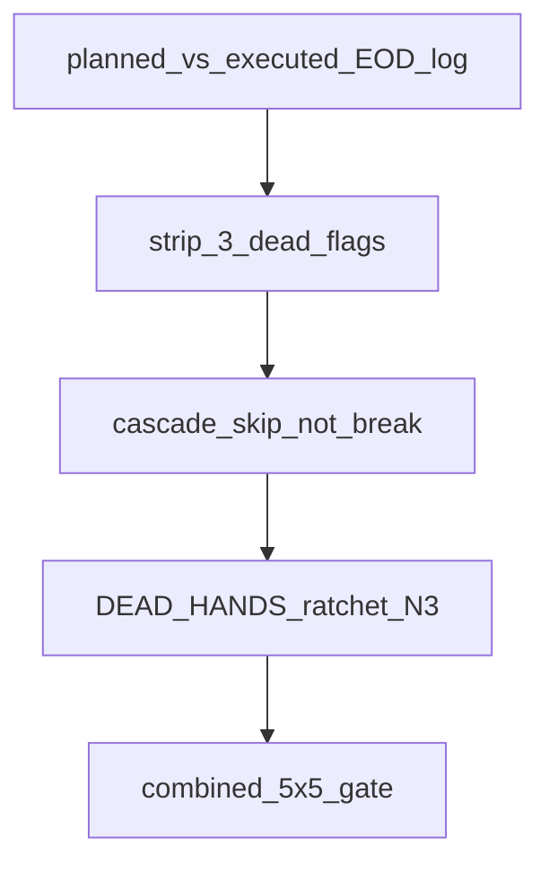

# Mode: PLAN

# Post-submit: remaining log points (bundle)

Point **1** (submit current build) is done — you already submitted. Point **5** is process only (freeze window before Sep 30). This plan implements **2 + 3 + 4 in one PR**, one combined smoke/5×5 at the end. Keep **`ZONE_OPS_MIX` default on**; do not re-enable dead experiments.

## 2a — Planned vs executed log (behavior-neutral)

In [`agent/executor.py`](agent/executor.py):

- At dawn (with existing `[hands] … h0` block): for each hand, set `planned_ops[w]` = number of non-PASS tile actions still due today — walk each owned tile with `tile_ops.tile_needs_work` / one-pass estimate of remaining day’s verbs (same snake tiles as `_worker_action`). Store on the executor.
- During the day: increment `executed_nonpass[w]` in `_emit_action` when verb is not `PASS` (and not pure wait).
- End of day (hour 23 after hands act, or next dawn before reset): emit  
  `[hands] d=D hireN eod planned=X executed=Y gap=X-Y`  
  then clear counters.

No strategy change — diagnostic only (separates “nothing queued” vs “planned but not run”).

## 2b — Strip three dead flags

Remove flags and gated code (defaults already off → no live behavior change):

| Remove | Keep |
|--|--|
| `ZONE_OPS_BUDGET` + `rebalance_zones_for_ops` / dawn call | `ZONE_OPS_MIX` + `repack_land_mix` |
| `ZONE_IDLE_FILLER` + `_idle_filler` hooks | Wave-1 `animal=`/`crop=`/`est_ops=` dawn lines |
| `ZONE_TILE_RESIZE` + `resize_land_tiles` + resize branch in `_construction_mix_and_resize` | Construction mix-only path |

Banner prints only `ZONE_OPS_MIX`. Trim dead helpers in [`agent/zoning.py`](agent/zoning.py) / [`agent/solvers/common.py`](agent/solvers/common.py) / [`agent/solvers/twoland_wsp.py`](agent/solvers/twoland_wsp.py) / [`agent/executor.py`](agent/executor.py).

## 3 — Cascade skip-not-break

In [`agent/solvers/twoland_wsp.py`](agent/solvers/twoland_wsp.py) cascade (and matching [`threeland_wsp.py`](agent/solvers/threeland_wsp.py) for parity):

On `res is None` (and treat `picks==0` the same if that path still breaks):

- Log `[planner] twoland cascade skip={worker} reason=INFEASIBLE solved=N` (parser already knows skip language).
- **Do not** append that worker to `solved_workers`.
- Handoff: `_locked_conservative_handoff` from current `opening` + that worker’s locked vectors (same as `n_empty==0` path) so cash cascade continues.
- **`continue`** to the next worker — never `break`.

Add `zone_outcomes: dict[str, str]` on [`SolveResult`](agent/solvers/types.py): `ok` / `infeasible` / `picks0` / `empty`.

This overrides older “must break” stack wording for WSP; hire remains a sequential prefix — skip only affects **which zones get new queues**.

## 4 — Dead-zone ratchet (N=3)

**N = 3** (from prior dead-zone draft).

In [`agent/planner.py`](agent/planner.py):

- `ZONE_SOLVE_STREAK: dict[str, int]`, `DEAD_HANDS: set[str]`, `STUCK_THRESHOLD = 3`.
- After each dawn `solve`, `update_zone_streaks(day, empty_counts, zone_outcomes)`:
  - `empty>0` and outcome ≠ `ok` → streak++
  - `ok` → streak 0, remove from `DEAD_HANDS`, log recovery
  - streak ≥ 3 → add to `DEAD_HANDS`, log `[planner] zone_streak worker=hireX d=D streak=3 status=stuck`
- When setting `NUM_ACTIVE_HIRES` from `solved_workers`, compute hire depth from hands that are solved **and not in `DEAD_HANDS`** (still `max(4, …)`). Dead middle hands may still be hired as sequential prefix when a later healthy hand is needed — unavoidable; ratchet stops *expanding* for permanently failing tails and clears cost pressure when the failing zone was the only reason to stay wide.
- Extend market hire log with `dead=hireX,…` when non-empty.

## Gate (one combined 5×5)

Baseline = current submitted defaults (`ZONE_OPS_MIX=1`, dead flags gone).

| Check | Pass |
|--|--|
| Smoke / 5×5 | No crash; eod `planned=` / `executed=` / `gap=` lines present |
| Cascade | `cascade stop` mean must not rise; expect `cascade skip=` instead of hard stops starving later lands |
| Reward | Report min/median/max; no min collapse vs pre-change 5×5 band |
| Ratchet | At least confirm logs can emit `zone_streak` / `dead=` on a forced or natural fail (smoke may show zero stuck — OK) |

**No Kaggle submit** in this PR unless you explicitly ask after the gate.

## Out of scope

- Re-trying park filler / tile-resize / dawn live rebalance
- Hire-on-demand `EARLIEST_NEEDED_DAY` full rewrite (not in tree; skip-continue + ratchet are the agreed slices)
- Leftover-tile CP-SAT / catalog rewrite
