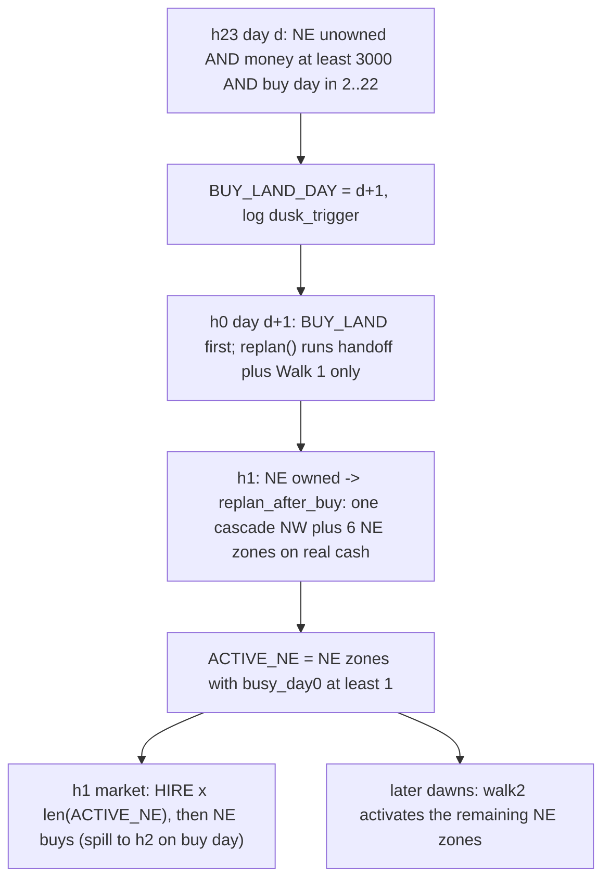

# Robust NE buy: forecast guard, dusk trigger, buy-day joint replan

This adopts the 3-wave plan from `.cursor/logs.txt`. I checked it against the current code:
- **Confirmed root-cause risk:** in `replan()` ([milos/planner.py](milos/planner.py)), `make_price_forecast(...)` has no guard, and `_maybe_trigger_ne_buy` runs *after* it. Any exception in the forecast skips the trigger, and the executor only logs `replan failed`.
- **Confirmed walk2 bug:** `worker = NE_WORKERS[len(ACTIVE_NE)]` re-picks a zone that is already active once a middle zone has been rolled back.
- **Resolved check:** `build_replan_lock` keys `locked_by_worker` by all `WORKERS`, NE included ([milos/replan_lock.py](milos/replan_lock.py) L488), so no fallback is needed.
- **Resolved check:** `forecast_day_counts` only simulates the h0 HIRE orders, which are NW. Several `ACTIVE_NE` entries don't affect it.



**Implement W1–W3 in one pass**, but make **one git commit per wave, in order**, so a regression can be bisected. Then run 3 unseeded smokes and report every wave's smoke checks as one combined checklist. Do not submit unless asked.

## W1: forecast guard and walk2 selection fix ([milos/planner.py](milos/planner.py))
- Add `_safe_price_of(obs, tile_queues, st_map, day)`. It wraps `make_price_forecast` in a try. On an exception it logs `[planner] forecast failed d=..: exc` and falls back to `wsp_data.i0_base_prices()`. Use it in `replan()`.
- In `_activate_next_ne`, pick the first pending zone instead of indexing by count:

```python
pending = [w for w in NE_WORKERS if w not in ACTIVE_NE]
if not pending:
    return
worker = pending[0]
```

- Smoke check: count `forecast failed` lines. Any at all confirms the root cause.

## W2: dusk cash trigger ([milos/planner.py](milos/planner.py), [milos/executor.py](milos/executor.py), [milos/market.py](milos/market.py))
- Set the constants to `NE_BUY_MIN_CASH = 3000`, `NE_BUY_FIRST_DAY = 2` and `NE_BUY_LAST_DAY = 22`.
- Add `schedule_ne_buy_at_dusk(me, day)`. It does nothing if NE is owned, or if `BUY_LAND_DAY` is already set for a later day. Otherwise, when `buy_day = day + 1` is in `[FIRST, LAST]` and `money >= NE_BUY_MIN_CASH`, it sets `BUY_LAND_DAY = buy_day` and logs `[ne] dusk_trigger`.
- Delete `_maybe_trigger_ne_buy` and its try block in `replan()`.
- In `executor.step()`, before `build_orders`: when `hour == 23 and day < SEASON_LAST_DAY`, call `planner.schedule_ne_buy_at_dusk(me, day)` inside its own try/except, which logs `dusk_trigger failed`.
- In the market's h0 `BUY_LAND` branch, also require `"NE" not in me["unlocked_quadrants"]`, so it can never buy SW by accident.
- Smoke check:
  - `dusk_trigger` fires on the first evening with money of at least 3000
  - `BUY_LAND` appears in the next day's h0 orders
  - no `land_fail`

## W3: buy-day joint replan
[milos/planner.py](milos/planner.py):
- Retire the LOCKED buy-morning path:
  - `is_buy_morning_locked` returns `False`; keep the signature, since other modules call it.
  - In `_activate_next_ne`, require `ne_owned`, and remove the `BUY_LAND_DAY == day` branch, the LOCKED tile branch and `reserve`.
- In `replan()` on buy morning (`BUY_LAND_DAY == day` and NE not yet owned), run the handoff and Walk 1, then skip Walk 2. The NE zones get planned at h1.
- Add `replan_after_buy(obs, tile_queues, tile_state)`, which runs once per buy day. It is guarded by `_BUY_REPLAN_DONE_DAY`, `BUY_LAND_DAY == day`, NE owned, and `2 <= day < SEASON_LAST_DAY`.
  1. Get `price_of` from `_safe_price_of` and set `horizon = NUM_DAYS - day`.
  2. Call `build_replan_lock(...)` and filter the replan tiles to **NE tiles only**. NW tiles are not eligible at h1. Walk 1 already planned them at h0, and the h0 NW seed buys match that plan. Tiles with queues that Walk 1 committed are locked anyway by the `qi == 0 and queue` rule. NW workers stay in the cascade with their locked commitments, so their cash and spend are counted, but they have `empty_counts = 0`.
  3. Run one `solve(...)` with `workers=NW_WORKERS + NE_WORKERS`, `starting_money=int(me["money"])` (real post-buy cash), `max_time=24.0`, `track_shed=False` and `charge_hire_daily=True`.
  4. Do not write any NW tiles; they stay as Walk 1 left them.
  5. Go through the NE zones in `NE_WORKERS` order. Activate each zone that solved with `busy_day0 >= 1` via `_write_ne_activation(..., 0)` and set `NE_DUE_DAY[w] = day`. Leave the rest for walk2 on later dawns.
  6. Log `[ne] buy_replan d= money= nw_empty= ne_empty= active_ne= deferred= overage=`, where `overage` is `obs.get("remainingOverageTime")`. Log it before and after the solve.

[milos/executor.py](milos/executor.py):
- Replace the h0 post-replan `_empty_at_dawn` recompute with an h1 hook, placed before `build_orders` and `_bind_hands`:

```python
if hour == 1 and planner.BUY_LAND_DAY == day and "NE" in me.get("unlocked_quadrants", []):
    try:
        planner.replan_after_buy(obs, script.TILE_QUEUES, self._tile_state)
    except Exception as exc:
        _log(f"[ne] buy_replan failed d={day}: {exc}")
    self._empty_at_dawn = {idx for idx in range(workers.NUM_TILES) if _dawn_empty(me, idx, day)}
```

[milos/market.py](milos/market.py):
- On buy day, extend the buy window to h2 so the h1 HIREs can't crowd out the NE seed and animal buys:

```python
buy_hours = (0, 1, 2) if day == planner.BUY_LAND_DAY else (0, 1)
if day < script.SEASON_LAST_DAY and hour in buy_hours:
```

- Smoke check:
  - one `buy_replan` per run, with `active_ne` of at least 1 (ideally 3 or more)
  - in `buy_replan`, `nw_empty` is about 0, so NW isn't planned twice
  - in `buy_replan`, `overage` drops by no more than ~25s and stays above 20s afterwards
  - NE `[bind]` lines at h2
  - no overflow at buy-day h1/h2
  - no `walk2 failed` and no `land_fail`
  - walk2 never picks a zone that is already active

## Verify
Grep every smoke: `rg "\[ne\]|BUY_LAND|dusk_trigger|buy_replan|forecast failed|replan failed|walk[12] failed|overflow|land_fail"`.

## Tunables
`NE_BUY_MIN_CASH`, `NE_BUY_FIRST_DAY`, `NE_BUY_LAST_DAY` and the buy-replan `max_time` are single constants.