# Sept02 overhaul — all waves plus §7

# Mode: PLAN

You discarded the last ladder because it **skipped** the items that failed (pickup-first, `track_shed`, fert pipeline) and finished ~BASE. This plan does **every** agent change in [docs/twoland/Sept02_overhaul.md](docs/twoland/Sept02_overhaul.md) **and** §7. The doc file is currently missing from disk (was untracked); restore it from your copy or the prior chat before Act.

**Start:** `git switch main && git reset --hard d35bff5` then `git switch -c feat/sept02-all`. Do not merge leftover `c3edd27` / `feat/sept02-full-overhaul` code — re-port from `4dd026a` + the failure fixes below.

**Copy source:** `4dd026a` on `wip/overhaul-all-waves`. Bug-fix reference: `67d116f` (B1–B6). Never batch waves. Never commit [`scripts/smoke.txt`](scripts/smoke.txt). Never Kaggle-submit.

```mermaid
flowchart LR
  reset[reset d35bff5] --> w0[W0 logs]
  w0 --> w1[W1 E1 P3 plus 7.3]
  w1 --> w2[W2 S2 S6]
  w2 --> w3[W3 P1 P2 S3]
  w3 --> w4[W4 E2 plus 7.5]
  w4 --> w5a[W5a handoff]
  w5a --> w5b[W5b ledger plus fert]
  w5b --> w6[W6 S4 S5 plus 7.4]
  w6 --> w7[W7 M2]
  w7 --> w8[W8 7.1 plus 7.2]
```

## Hard rules (why the last run failed)

1. **No feature skip.** If 3× smoke median is below the previous wave, stay on that wave: name the cause, fix it, re-smoke. A waiver is only for noise (`|delta| < 5%` vs prior median). Dropping pickup-first / `track_shed` / fert is not a waiver.
2. **`net_tile_ops` is never raw `tile_ops_peak`.** Peak includes `PICKUP`/`DROP` ([`_TILE_OP_VERBS`](agent/executor.py)). Last time that set hire1–3 caps to 23 and the solver over-scheduled (~48k). Use §7.5 formula (Wave 4) or peak of **on-tile** verbs only (`PLANT`/`WATER`/`FEED`/… — not `PICKUP`/`DROP`).
3. **`track_shed=True` + Wave 2 `liquidity_floor` double-counts feed.** Farmer INFEASIBLE at `open0=21` last time. When the ledger is on: `replan_min_balance = hire_reserve` only (wheat/fert cash is `buy_w`/`buy_f`). Do not turn the ledger off.
4. **Do not buy fertilizer unless queues actually use `with_fert`.** Planner still stamps `CROP_PROFILE = "no_fert"`. Dawn `BUY FERTILIZER` + skip-dump without demand wastes cash (~33k / ~53k isolations). Buy only `total_fert_need` from **due `with_fert` tiles**, B1 dump-skip + `fert_reserve`.
5. **Pickup-first is §7.3, not a WEST-list reorder.** Naive `PICKUP_*` then leftover `WEST`×N from shed overshoots. Grammar: `PICKUP_*` (walk-to-shed via `_step_toward`) then `MOVE_TO` first tile via `_step_toward` — no blind direction list.

---

## Phase 0 — reset + BASE

- Hard-reset branch from `d35bff5`. Restore [`docs/twoland/Sept02_overhaul.md`](docs/twoland/Sept02_overhaul.md) if you still have it (spec only; not a wave).
- 3× [`scripts/smoke_test.sh`](scripts/smoke_test.sh) → record **BASE** median.

---

## Wave 0 — instrumentation (§3.2–§3.4)

Port from `4dd026a` into [`agent/executor.py`](agent/executor.py), [`agent/planner.py`](agent/planner.py), [`agent/solvers/twoland_wsp.py`](agent/solvers/twoland_wsp.py):

- Per-worker PASS counters + pass-streak WARN; dump at day 29
- Solver line: `early_stopped`, `n_patterns`, `written`, `open0=`
- `log_plan_drift` + `_last_solver_booked` at day 29
- Daily `tile_ops` + `tile_ops_peak` (**and** a `tile_ops_on_tile_peak` that excludes PICKUP/DROP, for Wave 4)

§3.1 replay `us_index` is already fixed — do not reopen.

**Gate:** counters in smoke log; median within ~5% of BASE.

---

## Wave 1 — E1 + P3 + §7.3 spawn-agnostic preambles

**Single commit.** Files: [`agent/executor.py`](agent/executor.py), [`agent/zoning.py`](agent/zoning.py), [`agent/planner.py`](agent/planner.py).

1. **E1:** any `PICKUP_*` off-shed → `_step_toward` shed door (`pre->shed`), never `pre-wait-shed` PASS.
2. **§7.3:** hire1–9 preambles become `("PICKUP_WHEAT", "PICKUP_ANIMALS")` only (fert step lands in Wave 5). After pickups, executor walks to `WORKER_ROUTES[0]` with `_step_toward` — delete leading `WEST`/`NORTH` before pickup on FIVE hire1–4. Leave FOUR as-is.
3. **P3:** [`_active_hand_hires`](agent/planner.py) already counts non-empty assignments; keep `NUM_ACTIVE_HIRES` **after** the INFEASIBLE early-return.
4. Same commit: bump `net_tile_ops` only if first-tile arrival slips, using **on-tile** peak — not raw `tile_ops_peak`.

**Gate:** `pre-wait-shed≈0`; smoke median ≥ BASE.

Also update memory-bank §9 (anti-patterns 20–21) with this wave.

---

## Wave 2 — S2 + S6 (do not revert cons floor)

[`twoland_wsp.py`](agent/solvers/twoland_wsp.py), [`zonewise_wsp.py`](agent/solvers/zonewise_wsp.py), [`zonewise.py`](agent/solvers/zonewise.py), [`monolithic.py`](agent/solvers/monolithic.py), [`planner.py`](agent/planner.py):

- `cons = NewIntVar(0, 200_000, …)`; break cascade on `open0 < 0`
- `replan_min_balance = liquidity_floor` while `track_shed` is still off
- Unconditional `apply_replan` state reset including `fert_today: False`

**Gate:** every INFEASIBLE log has `open0=`; median ≥ Wave 1. If hire4 INFEASIBLE spikes: tune floor or probe timing — **do not** unbounded `cons`.

---

## Wave 3 — P1 + P2 + S3 together

[`planner.py`](agent/planner.py), [`pricing.py`](agent/pricing.py), both WSP solvers:

- `marginal_unit_price` / `forecast_inventory`; no `del shops`; thread `market_inventory` + `days_remaining=horizon`
- Remove `GLUT_CAPS` from `_pattern_weight`; seed booked from locked harvest + prior zones

**Gate:** median ≥ Wave 2.

---

## Wave 4 — E2 + §7.5 ops formula

[`executor.py`](agent/executor.py), [`zoning.py`](agent/zoning.py):

1. Dawn `_refresh_animal_first_routes` (already-correct drain: do not advance `_route_idx` while `next_tile_action` returns an action).
2. **§7.5:** `net_tile_ops = 24 - len(preamble) - route_move_cost(tiles) - SHED_TRIP_RESERVE` (constant reserve 1–2). Cross-check vs `tile_ops_on_tile_peak`; do not copy pickup-inflated peaks.

**Gate:** median ≥ Wave 3; feed-wait / EGG PASS down in `pass_notes`.

---

## Wave 5 — S1a → S1 + E3 + M1 (no ablation-off)

### 5a

Port `w_levels`/`f_levels` return + non-farmer `w_levels[1]`/`f_levels[1]` in [`twoland_wsp.py`](agent/solvers/twoland_wsp.py). `track_shed` still False. Gate: smoke runs; no new INFEASIBLE.

### 5b — flip and keep the ledger

- [`planner.py`](agent/planner.py): `track_shed=True` for twoland replan; **`replan_min_balance = hire_reserve` only** (rule 3).
- [`tile_ops.py`](agent/tile_ops.py): drop `zone_has_animal` in `_may_fertilize_today`.
- [`script.py`](agent/script.py): `fert_pickup_needed` / `total_fert_need` from due `with_fert` ages.
- [`executor.py`](agent/executor.py) + [`zoning.py`](agent/zoning.py): `PICKUP_FERTILIZER` after animals; **B6** skip when need==0; walk-to-shed.
- [`market.py`](agent/market.py) + [`pricing.py`](agent/pricing.py): dawn-only `BUY_PRODUCT FERTILIZER` for `total_fert_need`; **B1** `fert_reserve` + skip FERTILIZER staple dump before day 29. Do not buy if need==0.

Re-apply §7.5 after fert preamble grows by one step.

**Gate:** no hourly fert buy/sell; fert applies when `with_fert` is on the tile; median ≥ Wave 4. If INFEASIBLE: fix cash/ledger coupling — **do not** set `track_shed=False`.

---

## Wave 6 — S4 + S5 + §7.4 parameterised probe

[`twoland_wsp.py`](agent/solvers/twoland_wsp.py) from `4dd026a` + `67d116f`:

- `PER_TILE_FLOOR` / weighted `empty×horizon` time / relative early stop (`early_stopped` on &lt;30% of zone solves)
- **§7.4 / S5:** `probe(quadrant) -> (value, cost)` with `LAND_COSTS = {2: 1000, 3: 2000, 4: 4000}`, `ROI_MARGIN`; wire **NE only** (no SW/SE buy). Probe **all LAND2_WORKERS** (cheap time cap), not hire5 leftover only
- **B3:** skip probe if `starting_money < LAND2_BUY_COST`
- **B5:** `_PROBE_CACHE` seeds buy-morning land-2 **before** solve; clear after

**Gate:** `BUY_LAND_DAY` not worse than Wave 5; median ≥ Wave 5.

---

## Wave 7 — M2

[`sell_dp.py`](agent/sell_dp.py), [`pricing.py`](agent/pricing.py) `allowed_sell_qty`: `PRICE_FLOOR_RATIO = 0.35`; wool cap `T//5` on **both** drip paths.

**Gate:** 3× median ≥ Wave 6.

---

## Wave 8 — §7.1 geometry + §7.2 hand→zone map

After Wave 7 is green (doc: 2-land waves first, then scale):

- **7.1:** layout builder from quadrant set `{SW, SE, NE, …}` so TWO is `FIVE + NE` data, not a one-off tuple paste. Keep FOUR/FIVE/TWO as named catalogs.
- **7.2:** explicit `hand_index → zone name` map in [`agent/workers.py`](agent/workers.py) / [`zoning.py`](agent/zoning.py) — stop assuming `hands[i] == hire{i+1}`. Fixes hire4/hand3 idle after NE buy (replay KPI).

No SW/SE purchase in this wave — probe shape from Wave 6 is enough.

**Gate:** 3× median ≥ Wave 7; hand3 `done`/`wait` not ~all-season PASS after land2 buy (smoke `pass_notes`).

---

## Parallel (you, not the agent)

§6: one Kaggle slot `zonewise` + `FIVE` after Wave 1 if you want the 107k live answer. Agent never submits.

## Merge

When Wave 8 gate passes: merge to `main`; write per-wave medians into [`.cursor/memory/progress.md`](.cursor/memory/progress.md).
