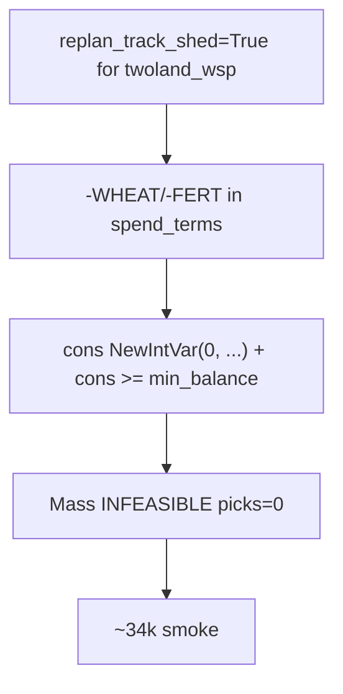

# Sept02 regression recovery

Diagnosis source: [`.cursor/logs.txt`](.cursor/logs.txt) — final merged median **~34k** vs BASE **~86k**. Wave 1 (E1, §7.3 preambles, P3) and instrumentation are fine; the collapse is solver cash coupling.

## Root causes (confirmed in code)



| Issue | Current (broken) | Baseline d35bff5 (worked) |
|-------|------------------|---------------------------|
| Conservative var | `NewIntVar(0, 200_000)` + `cons >= min_balance` in [`agent/solvers/twoland_wsp.py`](agent/solvers/twoland_wsp.py) L531–534 (also [`zonewise_wsp.py`](agent/solvers/zonewise_wsp.py) L504–507, [`zonewise.py`](agent/solvers/zonewise.py) L201–204) | `NewIntVar(-200_000, 200_000)`, no constraint on `cons` |
| WSP replan ledger | `replan_track_shed = True` both branches in [`agent/planner.py`](agent/planner.py) L794–799 | `track_shed=not _wsp_solver()` → **False** for twoland |
| WSP min_balance | `hire_reserve` / `liquidity_floor` passed into conservative | `replan_min_balance = 0` for WSP |

**Why cons≥0 is wrong:** `spend_terms` is spend-only (setup, hire, shed buys). Revenue never enters `conservative`; zones chain `opening = res["conservative"]`. Flooring at 0 encodes “total spend ≤ starting cash with zero reinvestment” — one animal zone can exhaust the cascade.

**Correct S2 semantics (keep):** runtime cascade break only:

```python
if opening[0] < 0:
    print(f"... handoff open0={opening[0]} < 0, stop cascade")
    break
```

**Where min_balance belongs:** on `balance_vars` only (L518–520 already sets `bal_floor = min_balance`). Do **not** constrain `conservative_vars`.

`pricing.marginal_unit_price(product, inv, already_booked, units)` — 4-arg calls in [`agent/planner.py`](agent/planner.py) and WSP solvers match the signature in [`agent/pricing.py`](agent/pricing.py) L102; no crash risk there.

---

## Phase 0 — Hotfix (1 commit, gate before re-ladder)

**Files:** [`agent/solvers/twoland_wsp.py`](agent/solvers/twoland_wsp.py), [`agent/solvers/zonewise_wsp.py`](agent/solvers/zonewise_wsp.py), [`agent/solvers/zonewise.py`](agent/solvers/zonewise.py), [`agent/planner.py`](agent/planner.py)

1. Revert conservative var in all three `_solve_zone` implementations:
   - `cons = model.NewIntVar(-200_000, 200_000, ...)`
   - **Delete** `if min_balance > 0: model.Add(cons >= min_balance)`
   - **Keep** `opening[0] < 0` cascade break in `twoland_wsp.solve()` (L779+)

2. Restore WSP replan knobs in [`agent/planner.py`](agent/planner.py):
   ```python
   if _wsp_solver():
       replan_min_balance = 0          # baseline; Wave 2 adds liquidity only when track_shed off
       replan_track_shed = False
   else:
       replan_min_balance = liquidity_floor
       replan_track_shed = True
   ```

3. **3×** [`scripts/smoke_test.sh`](scripts/smoke_test.sh) — record median.

**Gate:** median ≥ **80k** (noise waiver vs pre-overhaul ~87k). Diagnostics in one log:
   - `grep "twoland_wsp zone=" smoke.log | grep -c INFEASIBLE` — expect **≪75**
   - `grep "written=0" | wc -l` — should drop sharply
   - `grep pass_notes` — `pre-wait-shed` ≈ 0

Do **not** revert Wave 1 (executor walk-to-shed, geometry preambles, P3 hires) or Wave 0 instrumentation.

---

## Phase 1 — Re-ladder Waves 2–8 (one commit + 3× smoke each)

Process: each wave = isolated commit; if median drops >5% vs prior wave, **fix in that wave** (no feature skip). Never commit [`scripts/smoke.txt`](scripts/smoke.txt). Never Kaggle-submit.

### Wave 2 — S2 + S6 (corrected)

**Files:** same solvers + [`agent/planner.py`](agent/planner.py), [`agent/solvers/monolithic.py`](agent/solvers/monolithic.py)

- **S2:** unbounded `cons`; runtime `open0 < 0` break only; **no** `cons >= min_balance`
- While `track_shed=False`: `replan_min_balance = liquidity_floor` for **zonewise** only; WSP stays `0` until Wave 5b
- **S6:** unconditional `apply_replan` reset incl. `fert_today: False` (already landed — verify intact)

**Gate:** every INFEASIBLE line has `open0=`; median ≥ hotfix median.

### Wave 3 — P1 + P2 + S3

Already in tree ([`agent/planner.py`](agent/planner.py) `effective_price`, [`agent/solvers/twoland_wsp.py`](agent/solvers/twoland_wsp.py) `_marginal_glut_price`). Verify marginal pricing active; re-smoke only if Wave 2 gate passes.

**Gate:** median ≥ Wave 2.

### Wave 4 — E2 + §7.5

Keep [`agent/executor.py`](agent/executor.py) `_refresh_animal_first_routes` + [`agent/zoning.py`](agent/zoning.py) `_formula_net_tile_ops` in `bind()`.

**Do not** recalibrate from raw `tile_ops_peak` (prior mistake). Cross-check formula caps vs `tile_ops_on_tile_peak` in day-29 logs.

**Gate:** median ≥ Wave 3; feed-wait PASS down in `pass_notes`.

### Wave 5a — W/F handoff only

[`agent/solvers/twoland_wsp.py`](agent/solvers/twoland_wsp.py): `w_levels`/`f_levels` return + non-farmer handoff (L710–715) — **already present**.

**Planner:** `track_shed` still **False** on replan.

**Gate:** smoke runs; no INFEASIBLE spike vs Wave 4.

### Wave 5b — ledger + fert (correct coupling)

Flip ledger **without** re-breaking cons:

| Knob | Value |
|------|--------|
| `replan_track_shed` | `True` for twoland replan |
| `replan_min_balance` | **`hire_reserve` only** (not `liquidity_floor`) |
| `cons` var | stays **-200_000..200_000**, no `cons >= min_balance` |

Also:
- [`agent/script.py`](agent/script.py): `fert_pickup_needed` / `total_fert_need` — only `with_fert` queue profiles (B6)
- [`agent/zoning.py`](agent/zoning.py): add `PICKUP_FERTILIZER` to preamble **only in 5b** (not default in `_spawn_agnostic_preamble` fallback until then)
- [`agent/executor.py`](agent/executor.py) + [`agent/market.py`](agent/market.py): dawn-only `BUY_PRODUCT FERTILIZER`; B1 `fert_reserve` skip dump
- Re-run §7.5 formula after fert preamble grows by one step

**Gate:** no hourly fert churn; median ≥ Wave 4. If INFEASIBLE: tune hire_reserve / W-F seed — **never** `track_shed=False` ablation-off.

### Wave 6 — S4 + S5 + §7.4

[`agent/solvers/twoland_wsp.py`](agent/solvers/twoland_wsp.py): weighted zone time, `PER_TILE_FLOOR` early stop, all-`LAND2_WORKERS` ROI probe, B3/B5 cache — already present; verify after 5b green.

**Gate:** `BUY_LAND_DAY` not worse; median ≥ Wave 5.

### Wave 7 — M2

[`agent/sell_dp.py`](agent/sell_dp.py), [`agent/pricing.py`](agent/pricing.py): `PRICE_FLOOR_RATIO = 0.35`, wool `T//5` both drip paths — already present.

**Gate:** 3× median ≥ Wave 6.

### Wave 8 — §7.1 + §7.2

[`agent/zoning.py`](agent/zoning.py) `layout_from_land1_and_quadrants`; [`agent/workers.py`](agent/workers.py) `refresh_hand_zone_map` — already present; validate hand3 not all-season PASS after land2 buy.

**Gate:** 3× median ≥ Wave 7.

---

## Phase 2 — Merge + memory

When Wave 8 gate passes: update [`.cursor/memory/progress.md`](.cursor/memory/progress.md) with per-wave 3× medians and note corrected S2/5b semantics.

---

## Expected outcome

| Step | Expected median |
|------|-----------------|
| Hotfix | ~80–87k (restore cascade feasibility) |
| After Wave 4 | ≥ hotfix |
| After Wave 5b | may dip slightly; fix forward with hire-only min_balance |
| Final Wave 8 | target ≥ Wave 7, competitive with pre-overhaul ~87k |

## Anti-patterns to avoid (from logs + [docs/Road2TwoLandScaling.md](docs/Road2TwoLandScaling.md))

- Do not floor `conservative` at 0
- Do not put `min_balance` on `conservative_vars`
- Do not enable `track_shed` on WSP replan until Wave 5b, and never pair it with `liquidity_floor` on `cons`
- Do not batch multiple waves in one commit
- Do not buy/sell fert when `CROP_PROFILE = "no_fert"` and queues lack `with_fert`
