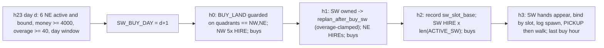

# SW land expansion (4k dusk trigger once NE is full)

## Facts this plan relies on (checked in env source)

- `BUY_LAND` takes no argument. The env unlocks `LAND_ORDER = ["NE", "SW", "SE"]` at `LAND_PRICES = [1000, 2000, 4000]`, so the second buy is SW for 2000 and a stray third buy would be SE for 4000.
- Hands reset every day (`farm["hands"] = []`), and the n-th hire of the day costs fib(n). With NW 5 + NE 6 active, SW hires 12, 16, 15 cost 144, 233, 377 per day. `zoning.bind()` assigns fib costs in zone order, so putting SW zones after NE in the layout gives exactly these costs. If fewer NE hands are hired, the real cost is lower than modeled, which errs on the safe side.
- `actTimeout=1` and `remainingOverageTime=60` for the whole episode. The NE buy replan can already use up to 24s.
- twoland `solve` sets `per_zone_time = max_time / len(worker_list)`, and only zones with empty tiles call CP-SAT. The SW buy replan's worst-case wall time is therefore about 3 SW zones x per-zone time. It is still clamped against the remaining overage below.
- `_owned_shed_tiles` / `_step_to_owned_shed` in [milos/executor.py](milos/executor.py) are generic. Once SW is owned, (4,5) becomes a usable shed tile; SE (5,5) stays LOCKED. SW zones use a PICKUP-only preamble plus that generic walk, not corner-hardcoded snakes, so a different spawn corner costs a few moves rather than breaking the route.

## Buy-day timeline

## W1 - Layout only ([milos/zoning.py](milos/zoning.py))

- Add `_column_south(x)` = `((x, y) for y in range(5, 10))`.
- Add `MILOS_THREELAND18` = TWOLAND12 coords plus `_column_south(4), (3), (2), (1), (0)` (indices 50-74). All 6 SW zones go after the NE zones. Defining all 6 means every SW tile has an owner (`worker_for_tile` never falls back to the farmer), and raising the cap later is a one-constant change:
  - `hire12` XIII: `(50, 51, 52, 53, 54)`, ops 16
  - `hire16` XIV: `(55, 56, 57, 58)`, ops 14
  - `hire15` XV: `(60, 61, 62, 63)`, ops 13
  - `hire14` XVI: `(65, 66, 67, 68)`, ops 13 (inactive under the cap)
  - `hire13` XVII: `(70, 71, 72, 73)`, ops 12 (inactive under the cap)
  - `hire17` XVIII: `(59, 64, 69, 74)`, walked in order 60 to 75, ops 11 (inactive under the cap)
  - all with `preamble=("PICKUP",)`, `start_hour=2`, `is_hand=True`
- Export `SW_WORKERS` in that activation order (nearest column first, as for `NE_WORKERS`) and `SW_TILES = frozenset(range(50, 75))`.
- Select the layout with a `KAGGRI_SW` env var or flag: `CURRENT = MILOS_THREELAND18 if SW_ENABLED else MILOS_TWOLAND12`, and add a `_layout_tag`.
- **Gate:** with the SW layout loaded and the trigger off, a pinned-seed smoke must give the same action trace as TWOLAND12. The SW tiles stay LOCKED, so the loops over `NUM_TILES` should treat them as inert.

## W2 - Planner SW state ([milos/planner.py](milos/planner.py), new code next to NE; NE functions unchanged)

- Globals and tunables:
  - `SW_ENABLED`, `SW_BUY_DAY`, `ACTIVE_SW`, `SW_BOUND_TODAY`, `SW_DUE_DAY`, `_SW_BUY_REPLAN_DONE_DAY`
  - `SW_LAND_COST = 2000`, `SW_BUY_MIN_CASH = 4000`
  - `SW_BUY_FIRST_DAY = 8`, `SW_BUY_LAST_DAY = 14`
  - `SW_MAX_ZONES = 3`
  - `SW_MIN_OVERAGE = 40.0`, `SW_OVERAGE_RESERVE = 12.0`, `SW_BUY_ZONE_TIME = 1.5`
- `active_workers()` becomes `NW_WORKERS + tuple(ACTIVE_NE) + tuple(ACTIVE_SW)`. It is unchanged while `ACTIVE_SW` is empty.
- `_sw_owned(me)`; `_sw_buy_allowed(me)` is true when `unlocked_quadrants` has length 2 and contains NE.
- `_ne_full()`: `len(ACTIVE_NE) == len(NE_WORKERS)` and `set(ACTIVE_NE) <= NE_BOUND_TODAY`. At h23 this means all 6 NE zones are active and every NE hand actually bound today.
- `schedule_sw_buy_at_dusk(obs, me, day)` requires all of:
  - `SW_ENABLED`, NE owned, SW not owned
  - `_ne_full()`
  - `SW_BUY_FIRST_DAY <= day + 1 <= SW_BUY_LAST_DAY`, and no pending `SW_BUY_DAY`
  - `money >= SW_BUY_MIN_CASH`
  - `obs["remainingOverageTime"] >= SW_MIN_OVERAGE`

  When all pass, it sets `SW_BUY_DAY = day + 1` and logs `[sw] dusk_trigger d= buy_day= money= overage=`. Otherwise it logs `[sw] dusk_skip reason=` once per day for the first failing condition (`ne_not_full`, `cash`, `overage`, `window`). That makes it visible when some NE zone is permanently rejected and SW never triggers.
- `dawn_sw_bound_handoff(...)` mirrors `dawn_ne_bound_handoff`:
  - `land_fail` (the buy day passed and SW is not owned): roll back all of `ACTIVE_SW`.
  - `hire_unbound` (due day is at or before yesterday and the hand did not bind): roll back that zone.
  - Clear `SW_BUY_DAY` once the buy day has passed.
- `_rollback_sw_zone` and `_write_sw_activation` are copies of the NE versions that act on `ACTIVE_SW` / `SW_DUE_DAY`. They reuse `_fresh_tile_state`, `chain_to_queue_items`, `_busy_counts` and `_zone_plan_cost`.
- `replan_after_buy_sw(obs, ...)` runs at h1 when `SW_BUY_DAY == day`, SW is owned, and it hasn't already run today:
  - Call `build_replan_lock`, then keep only the SW tiles of `SW_WORKERS[:SW_MAX_ZONES]` as the replan set.
  - Solve with `workers = NW_WORKERS + tuple(ACTIVE_NE) + SW_WORKERS[:SW_MAX_ZONES]`. NW and NE get 0 empty tiles, so they only pass on the conservative cash handoff.
  - Set `max_time = min(SW_BUY_ZONE_TIME * len(workers), overage - SW_OVERAGE_RESERVE)`. If that is below `SW_BUY_ZONE_TIME * 3`, skip the solve, log `[sw] buy_replan skip overage=`, and let Walk 3 activate zones on later dawns.
  - Activate zones that are solved and have `busy_day0 >= 1`; defer the rest.
  - Log `[sw] buy_replan` with overage before and after.
- `_activate_next_sw` (Walk 3) works like `_activate_next_ne`, taking `pending[0]` of `SW_WORKERS[:SW_MAX_ZONES]`, and runs only while SW is owned and `len(ACTIVE_SW) < SW_MAX_ZONES`. It keeps the NE cash gate `money - (spend + hire * horizon) >= 0`.
- Changes to `replan()`:
  - Call `dawn_sw_bound_handoff` right after the NE handoff.
  - Record `n_ne = len(ACTIVE_NE)` before Walk 2.
  - Run Walk 3 only if Walk 2 accepted nothing today (so the same cash is never committed twice) and `SW_BUY_DAY != day`.
  - Wrap Walk 3 in its own try/except.

## W3 - Market ([milos/market.py](milos/market.py) `build_orders`)

- h0: if `SW_BUY_DAY == day` and `_sw_buy_allowed(me)`, add `["BUY_LAND"]` and reserve `SW_LAND_COST`, as the NE branch does. This can't happen on the same day as the NE branch, which requires NE not owned. The quadrant-count guard makes an accidental SE purchase impossible.
- h2: if SW is owned, put `["HIRE"] * len(ACTIVE_SW)` first in the order list.
- `buy_hours`: `(0, 1, 2, 3)` when `day == SW_BUY_DAY`; otherwise unchanged. The existing `MAX_ORDERS` overflow trim drops sells first.

## W4 - Executor hooks ([milos/executor.py](milos/executor.py) `step`, `_claim_worker`)

- h23: after the NE dusk call, run `planner.schedule_sw_buy_at_dusk(obs, me, day)` in its own try/except. It runs after the day's binds, so `NE_BOUND_TODAY` is complete.
- h1: if `SW_BUY_DAY == day` and SW is owned, run `replan_after_buy_sw`, then recompute `_empty_at_dawn` (copy the NE block).
- h2: set `self._sw_slot_base = len(me["hands"])`, which is the NW hands plus the NE hands actually hired. Reset it to `None` in `_on_new_day`. Because the base is observed rather than computed, a failed NE hire can't shift SW slots.
- `_claim_worker`: before the NE branch, if `_sw_slot_base is not None` and `slot >= _sw_slot_base`, bind `ACTIVE_SW[slot - base]`, add it to `SW_BOUND_TODAY`, and log `[bind] d= h= slotN=hireX pos=(x,y) expect=(x,y) owned=0|1 sw`.
  - `expect` comes from a diagnostic-only `SW_EXPECTED_SPAWN` dict taken from [data/milos_zoning.md](data/milos_zoning.md): hire12 at SW (4,5), hire15 at NE (5,4), hire16 at NW (4,4) or NE (5,4).
  - The dict is for the log only. Routing stays on PICKUP plus `_step_to_owned_shed`.
- h0: add a one-line `[ovg] d= remaining=` log (from `obs["remainingOverageTime"]`) so smokes show how much overage the dawn replans burn before the two big buy-day solves.

## W5 - Smoke analysis and verification (local only, no submit)

- Make `scripts/smoke_analysis/layout.py` / `parse_snap.py` pick up SW zones from the live layout (no hardcoded hire lists).
- Run 6 or more `scripts/smoke_test.sh` runs per arm (SW on / SW off), in parallel if CPU allows, plus one SW-on run with `townCenterSellInterval=24`.
- Check in the logs:
  - `[ovg]` trend across days, and overage before and after the `[ne] buy_replan` and `[sw] buy_replan` solves. The minimum must stay well above 0.
  - `[sw] dusk_skip reason=` distribution, e.g. how often `ne_not_full` blocks SW.
  - `[sw] dusk_trigger`, `[sw] buy_replan`, `[sw] accept|reject|rollback`
  - `[bind] ... sw` actual pos vs expect, and that the preamble reaches an owned shed tile in 1-2 moves.
  - `[market] overflow` on h2/h3 of the SW buy day, and `[snap] shed_total=`
  - `unlocked=` must never show SE.
- Compare final coins between the arms on the same seeds. Whether and what to submit is the user's call.

## Out of scope

- No changes to NE gates, NE functions, the MIP, or twoland `solve`.
- No activation of SW zones XVI-XVIII (hires 14/13/17). To enable them later, raise `SW_MAX_ZONES` once replays show SW zones clearly net positive.
- No generic multi-land refactor before the deadline.
