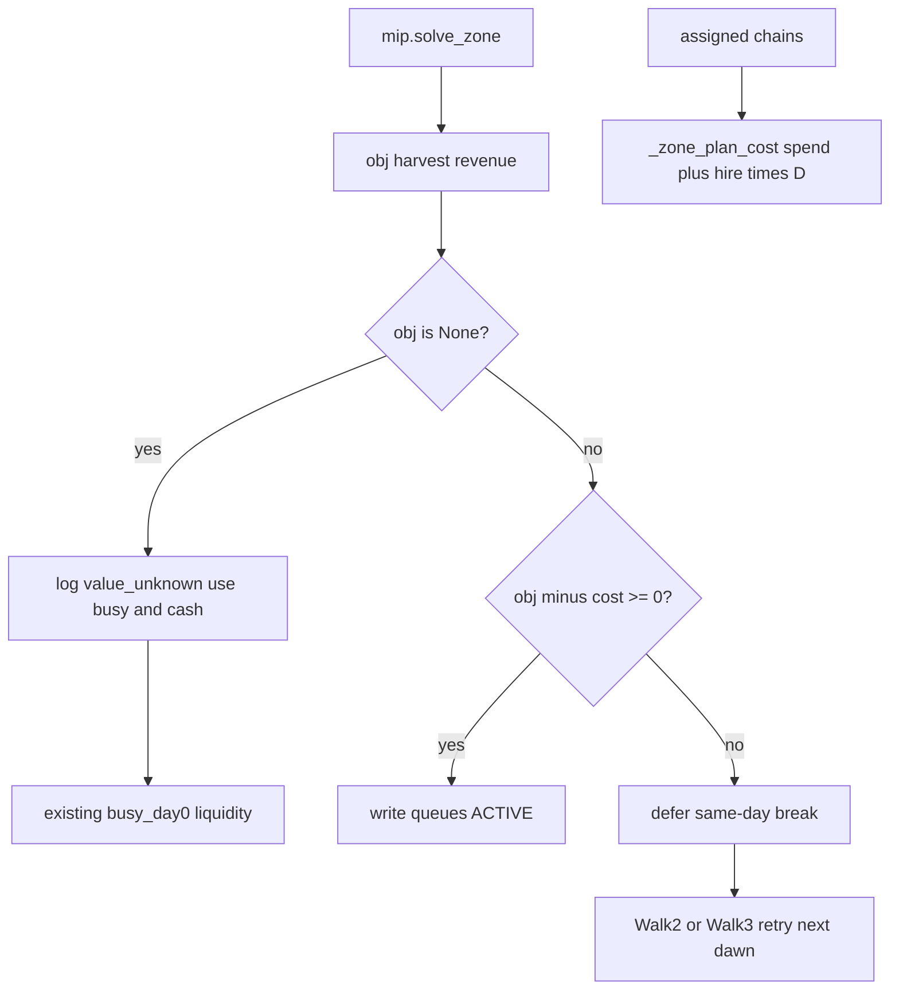

# Zone value activation gate

## Problem (from [.cursor/logs.txt](.cursor/logs.txt))

Smoke analysis shows SW zones can be **feasible and cash-affordable** but **economically negative** (e.g. hire14: solver `obj` ~3.8k vs ~6k hire burn over ~16 days). Today we activate every zone that passes `busy_day0`, liquidity (`money - _zone_plan_cost`), and `solved_workers`—see [milos/planner.py](milos/planner.py) `replan_after_buy_sw` / `replan_after_buy` loops (~919–936, ~1028–1045) and `_activate_next_sw` / `_activate_next_ne` (~417–428, ~594–601).

Land buys (NE/SW dusk triggers, cash/overage windows) stay as-is; only **“turn on another hire zone”** gets a worth-it check.

## Economic rule (data-driven, one knob)

`obj` from CP-SAT is **harvest revenue only** — hire is in the balance/conservative constraints, not in the maximize ([milos/wsp/mip.py](milos/wsp/mip.py) ~467–476 vs ~434–437). Seeds and animals are also **not** in `obj`. Full-horizon spend already exists: [`_zone_plan_cost`](milos/planner.py) stamps assigned chains via `_stamp_chain(..., horizon)` and returns **tile spend (all days) + hire×D**.

| Term | Source |
|------|--------|
| `obj_k` | CP-SAT objective from `mip.solve_zone` (gross harvest revenue) |
| `cost_k` | `_zone_plan_cost(assigned, horizon, worker, price_of)` = seed/animal spend over the **whole horizon** + `HAND_DAILY_COST[worker] * D` |
| `D` | `horizon = NUM_DAYS - day` at this activation attempt |

**Accept** zone `k` only if:

```text
obj_k - cost_k >= min_net
```

Optional ratio (only if env set locally): `obj_k >= (1 + margin_ratio) * cost_k`.

With `min_net=0`, hire14 stays clearly negative; hire13 (~+1.3k hire-only net) is about breakeven once ~0.5–1k spend is subtracted — that is the intended cutoff, not a hardcoded zone name.

**Contiguous prefix (same day only):** on buy-day replan, evaluate workers in layout order; on first `low_value` (or existing busy/liquidity fail), **break** — do not activate later zones that day. Fib cost rises; later zones would fail anyway **today**.

**Do not latch.** A buy-day reject is cash-starved and temporary (e.g. d=13 ~$2.8k vs hire10 obj 3.2k / ~15k realized). Walk 3 (`_activate_next_sw`, and Walk 2 for NE) already retries `pending[0]` on later dawns as cash builds. Do **not** add a rejected-forever set. Log `low_value` once per zone per day.

**Scope:** new activations only — no dawn rollback of already-active zones.

**`obj is None` fails open.** Live planner always `from milos.wsp.twoland import solve`, but if `zone_objectives` is missing (empty skip, INFEASIBLE, forgotten thread, oneland path), **do not** treat that as `low_value`. Log `value_unknown` and defer to existing `busy_day0` / liquidity / `solved_workers` checks. Treating None as reject would silently block all dawn activations (NE never fills).

## Shipped defaults (Kaggle has no env)

Same as `KAGGRI_SW`: env knobs are local-only. **What is in code is what ships.**

- `min_net = 0` — accept iff predicted net (`obj - cost`) is non-negative
- `margin_ratio = 0` — ratio form off unless `KAGGRI_ZONE_MARGIN_RATIO` is set locally

Calibrate later from `obj - cost` vs the smoke per-zone P&L proxy across runs; do not pick a feel-good ratio as the default.

## Implementation

### 1. Surface per-zone objective from the WSP cascade

- [milos/wsp/mip.py](milos/wsp/mip.py): include `objective: int` in the dict returned from `solve_zone`.
- [milos/wsp/twoland.py](milos/wsp/twoland.py) **and** [milos/wsp/oneland.py](milos/wsp/oneland.py): accumulate `zone_objectives: dict[str, int]` (oneland still, so a layout fallback cannot leave obj empty).
- [milos/wsp/types.py](milos/wsp/types.py): `zone_objectives: dict[str, int] = field(default_factory=dict)` on `SolveResult`.

### 2. Central gate in planner

```python
def _zone_value_ok(obj: int | float | None, cost: int) -> tuple[bool, str]:
    # None -> (True, "value_unknown")  # fail open
    # net = obj - cost; reject if net < MIN_NET (default 0)
```

Env (local only): `KAGGRI_ZONE_MIN_NET`, `KAGGRI_ZONE_MARGIN_RATIO`. Defaults above.

Logs: `[ne|sw] reject d=… zone=… reason=low_value obj=… cost=… net=…` or `reason=value_unknown`.

### 3. Wire into activation paths

**A. Buy-day replan** — `replan_after_buy` and `replan_after_buy_sw`:

After existing checks, compute `cost = _zone_plan_cost(zone_assigned, horizon, worker, price_of)` and require `_zone_value_ok(result.zone_objectives.get(worker), cost)`. On `low_value`: append to `deferred`, **`break`** (same-day prefix only).

After the SW loop: if `len(active) < 2`, log `[sw] buy_replan wasted_land n_active=…` (2k land with fewer than two paying zones). Do **not** un-buy land; this is a diagnostic / verification fail.

**B. Dawn walk** — `_activate_next_ne` and `_activate_next_sw`:

Reuse the `cost` already computed for liquidity. Same `_zone_value_ok`. Reject `low_value` before `_write_*_activation`. Next dawn retries the same pending worker (no latch). Solves are ~0.15s.

### 4. What we are *not* changing

- `SW_MAX_ZONES`, `SW_BUY_MIN_CASH`, dusk NE/SW land scheduling — keep as upper bounds / land gates.
- No change to main dawn `_replan_active` for already-active zones (no release).
- No dusk-time “will we get 2 profitable SW zones?” pre-solve in this pass (follow-up if `wasted_land` fires often).

## Verification

Do **not** judge by final reward across 8 smokes. Dropping hire14 is ~3k on a ~128k score, inside noise.

Check instead:

- `active_sw` on buy-day / later dawns **stops before hire14** (first `low_value` in SW prefix).
- **NE still activates all 5 zones** — this is what catches a None-obj fail-closed bug.
- `obj − cost` predicts the realized per-zone P&L from the smoke proxy chart across runs; keep `min_net=0` unless that comparison says otherwise.
- SW buy-day `n_active >= 2` (else `wasted_land` — 2k land spent for one or zero zones).
- Grep: `reason=low_value` on the first failing SW zone; `value_unknown` should be rare/absent on live twoland.


