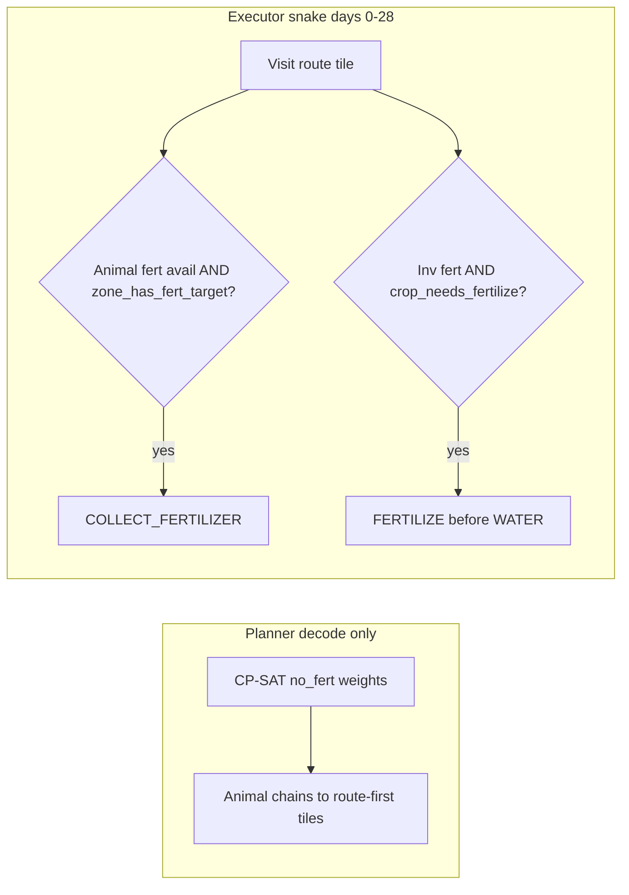

# Fertilizer / planner regression — what was done (last 4 commits)

**Status:** Not working reliably on Kaggle. Use this as notes to start over.

**HEAD at time of writing:** `6c44866` (Aug 18, 2026)

---

## Goal (post-planning fertilizer)

- Planner stays on `no_fert` chain weights in CP-SAT.
- At **runtime** (days 0–28), use animal `COLLECT_FERTILIZER` + inventory `FERTILIZE` on crops using `with_fert` ages from `data/crop_rollouts.json`.
- **No** shed `PICKUP FERTILIZER`.
- Animals should sit on **route-first** tiles per zone so collect happens early on the snake path.
- Fertilize ages (with_fert): WHEAT/CARROT age 2; TOMATO 7+10; STRAWBERRY 9+13; MELON excluded.

---

## Commit timeline (oldest → newest)

| Commit | Message | Files |
|--------|---------|-------|
| `d19fa30` | Enhance Executor and Tile Operations for Worker Management | `executor.py`, `planner.py`, `tile_ops.py` |
| `b3a9ef9` | Enhance Executor and Planner Logic for Worker Route Management | `executor.py`, `planner.py` |
| `64a1aed` | Update Active Context and Progress Documentation | `.cursor/memory/*` only |
| `6c44866` | Update Solver Parameters for Improved Performance | `planner.py` |

---

## Commit 1 — `d19fa30` — Runtime fertilizer + animal decode sort

### Design

1. **Planner decode only:** after CP-SAT solve, sort assigned chains so any chain containing an animal lands on route-first empty tiles.
2. **Executor:** pass `worker` into tile ops for zone-scoped collect gate.
3. **Tile ops:** apply FERTILIZE from inventory before rollout tape; gate COLLECT_FERTILIZER.

### `agent/planner.py` — animal-first decode

```python
def _chain_has_animal(raw_chain: list) -> bool:
    return any(_parse_profile_key(k)[0] in ANIMAL_NAMES for k, _ in raw_chain)

# In _solve_assignment decode (per worker):
slots: list[list] = []
for ci, chain in enumerate(chains):
    n = int(solver.Value(count[worker][ci]))
    for _ in range(n):
        slots.append(chain["raw_chain"])
slots.sort(key=lambda c: (0 if _chain_has_animal(c) else 1))
for i, idx in enumerate(remaining):
    assigned[idx] = slots[i]
```

**Before:** chains assigned in catalog order to `remaining.pop(0)`.

### `agent/tile_ops.py` — new helpers

```python
def crop_needs_fertilize(tile: dict, crop: str, day: int) -> bool:
    if crop == "MELON" or "with_fert" not in rollouts.profiles_for(crop):
        return False
    age = day - tile["planted_day"]
    if age not in rollouts.fertilize_ages(crop, "with_fert"):
        return False
    return tile.get("fertilized_until_day", -1) < day

def zone_has_fert_target(me: dict, worker: str, day: int) -> bool:
    for idx in workers.WORKER_TILES[worker]:
        tile = _tile_at(me, idx)
        if isinstance(tile, dict) and tile.get("kind") == "PLANT":
            if crop_needs_fertilize(tile, tile["crop"], day):
                return True
    return False
```

### `agent/tile_ops.py` — `_crop_action` (FERTILIZE before tape)

```python
def _crop_action(tile, day, item, harvest_only, private, inv_idx):
    crop = tile["crop"]
    profile = item.profile if item.kind == "crop" else script.CROP_PROFILE
    age = day - tile["planted_day"]

    if not harvest_only:
        inv = _inv_at(private, inv_idx)
        if inv.get("FERTILIZER", 0) > 0 and crop_needs_fertilize(tile, crop, day):
            return ["FERTILIZE"]

    actions = rollouts.actions_at_age(crop, age, profile)
    # ... rest of rollout tape loop
```

Queue items still use `CROP_PROFILE = "no_fert"` from planner — fert timing is **injected** at runtime, not from queue profile.

### `agent/tile_ops.py` — `_animal_action` (gated COLLECT)

```python
if act == "COLLECT_FERTILIZER":
    if not tile.get("fertilizer_available"):
        continue
    if worker is None or not zone_has_fert_target(me, worker, day):
        continue
```

### `agent/tile_ops.py` — `worker` threaded through

- `tile_needs_work(..., worker=None)`
- `next_tile_action(..., worker=None)`
- `_lifecycle_pending(..., me, worker=None)`
- `_crop_action` gained `private`, `inv_idx`
- `_animal_action` gained `me`, `worker`

### `agent/executor.py` — pass `worker=`

All `next_tile_action` / `tile_needs_work` calls include `worker=worker`, including snake path, `_zone_pending`, `_endgame_action`, `_endgame_tile_needs_work`.

---

## Commit 2 — `b3a9ef9` — Weed rewind + tile-0 exclusion

### `agent/executor.py` — weed rewind (before route logic)

```python
route = workers.WORKER_ROUTES[worker]
for ri, tidx in enumerate(route):
    if ri < self._route_idx[worker]:
        tile = _tile_at(me, tidx)
        if isinstance(tile, dict) and tile.get("kind") == "WEED":
            self._route_idx[worker] = ri
            break
```

If a WEED appears on a tile already passed this day, rewind route index to DIG same day.

### `agent/planner.py` — exclude tile 0 from import solve

```python
# _build_from_solver()
empty_tiles = [t for t in range(NUM_TILES) if t != 0]
empty_counts = {
    w: sum(1 for idx in WORKER_TILES[w] if idx in empty_tiles) for w in WORKERS
}
assigned = _solve_assignment(..., empty_tiles=empty_tiles, ...)
```

**Intent:** avoid assigning animals to shed-door tile 0.

**Problem:** Tile 0 is plantable (log `t1` = index 0). Exclusion caused `empty=24`, empty queue on tile 0, d=0 replan `assign=4`, and worse assignments. **Likely should be reverted.**

---

## Commit 3 — `64a1aed` — Memory docs only

Updated `.cursor/memory/active_context.md` and `progress.md` — no agent code.

---

## Commit 4 — `6c44866` — Solver workers + 10s cap (all solves)

```python
solver = cp_model.CpSolver()
solver.parameters.num_workers = 8          # was os.cpu_count() or 1
solver.parameters.max_time_in_seconds = 10.0  # new — applies to ALL _solve_assignment calls
```

Removed `import os`.

**`OBJECTIVE_GOOD_ENOUGH = 80_000`** unchanged. Callback threshold = `max(1000, 80000 * horizon / 30)`. On objective scale ~49k OPTIMAL, **`good_enough` never fires** (`good_enough=False` even at OPTIMAL).

---

## Current code state at HEAD (`6c44866`)

### Planner decode (still animal-first, no composite guard)

```python
slots.sort(key=lambda c: (0 if _chain_has_animal(c) else 1))
for i, idx in enumerate(remaining):
    assigned[idx] = slots[i]
```

No `_chain_is_animal_only` / `_prefer_composite_on_route_first` in committed code.

### Import solve

- `empty_tiles` excludes tile 0
- Single `max_time_in_seconds = 10.0` for import and replan alike
- No split 10s/5s per caller

---

## Submission failures observed

### `260818_2` — turn 0 timeout

```
[planner] status=OPTIMAL obj=49470 time=60.956s horizon=30 empty=24
```

Only `farmer PASS market-hour` — agent killed before playing. Import solve took ~61s on Kaggle VM (before 10s cap commit, with `os.cpu_count()`).

### `260818_1` — sheep on last farmer tile

- Pre tile-0 fix + animal sort: COW t1, SHEEP **t9** (last route tile).
- Bank ~36.5k live.

### `260818_3` — broken assignment (10s FEASIBLE + tile-0 + animal-only on route-first)

```
[planner] status=FEASIBLE obj=46485 time=9.996s horizon=30 empty=24
[planner] replan d=0 assign=4 preserved=21
```

- **5× SHEEP** on farmer t1,t2,t3,t7,t8
- `BUILD_PASTURE farmer t1` on **d=1** — no PLANT first (animal-only chain `[["SHEEP_with_care", 0]]`)
- Money **$9** by d=7 (FEED + BUY WHEAT for 5 sheep)
- Fert COLLECT/FERTILIZE ran but economy collapsed
- Bank ~31.8k

### Local smoke after partial fixes (session, may not match HEAD)

- Revert tile-0 + composite guard + split time limits → smoke **~51k**
- Not committed to git at doc write time

---

## Architecture (intended flow)



---

## Catalog context (animal chains)

From `data/handmade_dp_candidates.json`:

- **Animal-only:** `[["SHEEP_with_care", 0]]` → BUILD_PASTURE immediately on empty tile.
- **Composite (good):** `[["WHEAT_no_fert", 0], ["SHEEP_with_care", 5]]` → PLANT d=0, pasture d=5.

Animal-first sort without composite guard puts animal-only chains on route-first tiles → early pasture, no crop.

---

## What was NOT done / out of scope

- Planner `with_fert` profiles in CP-SAT model
- Shed `PICKUP FERTILIZER`
- Fertilize on day 29 (endgame harvest-only)
- Changing `market.py` sell policy

---

## Likely fixes to try when starting over

1. **Revert tile-0 exclusion** — `empty_tiles = list(range(NUM_TILES))`.
2. **Keep animal-first sort** but **never put animal-only chain on first route tile** in a zone — prefer `[WHEAT, 0], [SHEEP, 5]` composites on route-first animal slots.
3. **Split solver time limits:** import `10s`, replan `5s` (not one blanket 10s).
4. **Keep `OBJECTIVE_GOOD_ENOUGH = 80_000`** OR rescale if objective is ~49k (80k callback never triggers).
5. **Verify on Kaggle** after import solve time < 10s and `assign=1` at d=0 replan.
6. Runtime fert logic in `tile_ops.py` / `executor.py` worker wiring is probably fine — regressions were mostly **planner assignment**, not COLLECT/FERTILIZE gates.

---

## Key files

| File | Role |
|------|------|
| `agent/planner.py` | Decode sort, `_build_from_solver`, `_solve_assignment`, replan |
| `agent/tile_ops.py` | `crop_needs_fertilize`, `zone_has_fert_target`, FERTILIZE/COLLECT |
| `agent/executor.py` | `worker=` passthrough, weed rewind |
| `data/crop_rollouts.json` | `with_fert` fertilize_ages |
| `data/handmade_dp_candidates.json` | crop vs animal-only vs composite chains |
