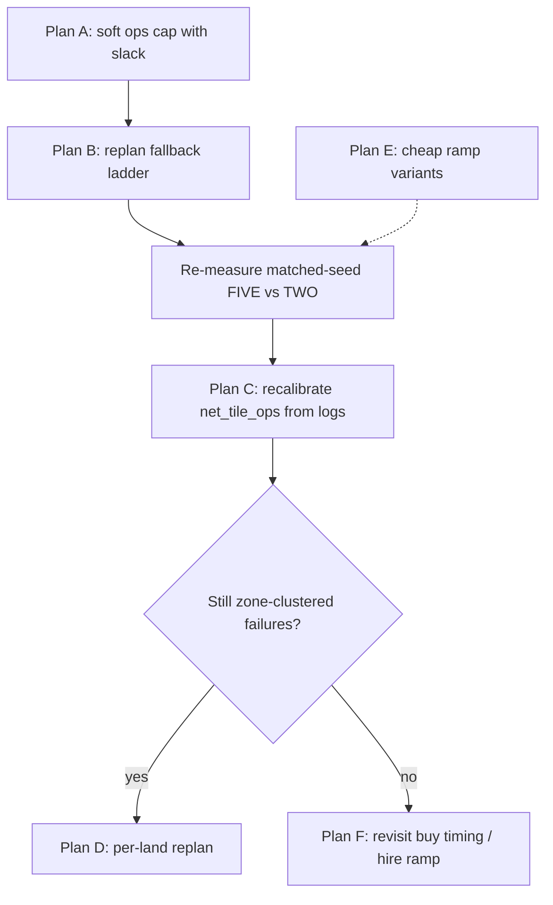

# Two-Land Approach: Why Replans Go INFEASIBLE, and What to Do Next

## Version history

| Version | Date | Summary |
|---------|------|---------|
| **v1** | 2026-08-26 | Initial diagnosis from `260826_2` / `260826_3` logs + instrumented reruns. INFEASIBLE attributed to locked ops exceeding zone cap. |
| **v2** | 2026-08-26 | Pickups rollout fix: agent loads [`animal_with_pickups.json`](../data/animal_with_pickups.json); tile-only [`animal_rollouts.json`](../data/animal_rollouts.json) kept for notebooks. Ops cap uses `daily_tile_ops` only. Much of v1 overflow was **double-counting**. Smoke ~63–85k depending on run. |

Analysis of submissions [`260826_2`](../submissions/260826_2) (threshold-buy, ran to 100 tiles)
and [`260826_3`](../submissions/260826_3) (day-0 NE buy, 50 tiles, 9 hires), plus a local
instrumented rerun that records *which constraint* fails on every INFEASIBLE solve.

## TL;DR

**v1:** The dawn replan is not failing because of money. It fails because **locked (already-committed)
tiles alone exceed a zone's daily op cap**, by 1–3 ops. The cap is a hard constraint over work the
solver cannot change, so no `IDLE` fallback can rescue it — and because it is one monolithic
50-tile model, **a single over-budget zone blocks replanning for all 50 tiles**, for the rest of
the season.

**v2 (post pickups fix):** A large share of v1 overflows were **false positives** — four counters
summed into the cap while the JSON only listed tile actions. After single-term `daily_tile_ops`
and pickups-inclusive rollouts, INFEASIBLE dawns still occur but for **honest** over-cap (inflated
per-animal PICKUP counts vs zone caps 14/15). Next lever: soft slack (Plan A) or cap recalibration (Plan C).

At matched seeds, two-land is currently **not better** than one-land:

| Seed | FIVE (25 tiles) | TWO (50 tiles) | TWO infeasible replans |
|------|-----------------|----------------|------------------------|
| 11 | 83,262 | 66,300 | 17 (13 ops-only) |
| 22 | 75,155 | 72,123 | 18 (15 ops-only) |

We are paying $1000 + $88/day in hires for land that the planner can no longer schedule.

## Evidence

Instrumenting `_solve_assignment` to classify every failure (ops-cap violation from locked work
alone vs. cash-negative with every replan tile set to `IDLE`):

| Layout | Infeasible solves | ops-only | cash-only | both | unexplained |
|--------|-------------------|----------|-----------|------|-------------|
| FIVE (one land) | 6–9 | 2–4 | 1–4 | 1–3 | 0 |
| TWO (two lands) | 17–24 | 12–22 | 0–3 | 1–3 | 0 |

Every failure is explained; none are solver timeouts (all report `status=INFEASIBLE`, not
`UNKNOWN`). The failure *mode* flips between layouts: one-land failures are mostly early-season
cash squeezes, two-land failures are overwhelmingly ops-cap overflow.

Representative overflows, with the op breakdown:

```
OPS zone_VI  day+0:  locked=17 > cap=14   tile_ops=12 wheat_pickup=2 animal_place=2 animal_preamble=1
OPS zone_III day+15: locked=17 > cap=14   tile_ops=17
OPS farmer   day+8:  locked=18 > cap=15   tile_ops=17 wheat_pickup=1
OPS zone_V   day+8:  locked=17 > cap=15   tile_ops=15 wheat_pickup=1 animal_preamble=1
```

Overflow is always small — the histogram across a full season is `{1 op: 8, 2 ops: 2, 3 ops: 17}`.

The killer is persistence. Once a zone's *board state* is over budget, it stays over budget:

```
horizon=12 ... OPS zone_VI day+0: locked=17 > cap=14
horizon=11 ... OPS zone_VI day+0: locked=17 > cap=14
horizon=10 ... OPS zone_VI day+0: locked=17 > cap=14
...  (identical every remaining day, down to horizon=2)
```

Each of those dawns had 10–15 replan-eligible tiles that got no plan at all, because
[`replan()`](../agent/planner.py) returns early on `RuntimeError` and preserves stale queues.
Money on those days was $29k–$66k. It was never a budget problem.

## Root causes

### v1 — Original diagnosis (pre pickups fix)

#### 1. The op cap is hard over work the solver does not control

```595:617:agent/planner.py
            locked_ops = (
                locked["daily_tile_ops"][day]
                + locked["daily_wheat_pickup"][day]
                + locked["daily_animal_place"][day]
                + locked["daily_fert_pickup"][day]
            )
            # ... +1 preamble when locked animals active
            model.Add(sum(terms) + locked_ops <= cap)
```

When `locked_ops > cap`, the model is infeasible before any decision variable is considered. The
`IDLE` chain (present at `_build_chains`, id `"IDLE"`) contributes zero terms and therefore cannot
help.

This mismatches the executor, which is best-effort: given 17 ops of work and 14 hours, a hand
simply doesn't finish some of them. The planner treats the same situation as unschedulable.

#### 2. `net_tile_ops` for TWO is optimistic, especially on Land 2

`data/two_lands.md` hand-lowered the farmer from 18 to 15 "due to mirroring TwoLand plan" and gave
Land-2 zones the same caps as their Land-1 twins (14/14/15/15). But Land-2 hands pay strictly more
overhead in practice — the `zone_VI` failure above is `wheat_pickup=2` and `animal_place=2` on top
of 12 tile ops, plus the animal preamble. The caps were derived from route length, not from
observed per-day workload of a mature animal-heavy zone.

*(v1 note: the `zone_VI` breakdown later turned out to be mostly **double-counting** — see v2.)*

#### 3. One monolithic model, ten hard AND-constraints

Ten zones each impose a per-day cap. The probability that at least one zone overflows on a given
dawn grows with the number of zones, and any single overflow discards the entire solve. This is
the structural reason two-land is *harder than twice one-land*, not merely twice as big.

#### 4. Mirror constraints couple unequal zones

`MIRROR_PAIRS` forces `count[w1][ci] == count[w2][ci]`. Combined with
`sum(count[worker]) == zempty`, this implicitly requires the mirrored zones to have the **same
number of replan-eligible tiles**. It happens to hold on day 0 (all zones have 5 empty tiles), but
it makes the day-0 plan push Land-1's workload onto Land-2 zones that carry more overhead — which
is how `zone_VI` gets over-committed in the first place. Mirroring is currently off during replan
(`land_budget=None`), so it is a day-0-only effect, but it seeds the problem.

---

### v2 — After pickups rollout + single-term ops cap (shipped)

**What changed:** Agent and planner load [`data/animal_with_pickups.json`](../data/animal_with_pickups.json)
(pickups-inclusive actions). [`data/animal_rollouts.json`](../data/animal_rollouts.json) remains
tile-only for experiments/notebooks. Both ship in the submission bundle. Ops cap in `_solve_assignment`
uses **`daily_tile_ops` only** — no separate `wheat_pickup` / `animal_place` / `fert_pickup` /
preamble terms. Stamping no longer adds side-channel increments or extra `build_day += 1`. Executor
skips `PICKUP`/`BUILD_*`/`PLACE` in the tile action loop (preamble handles pickups).

**Revised reading of v1 evidence:** Most INFEASIBLE dawns in the v1 table were **false positives
from double-counting**, not honest over-cap schedules. Example: `locked=17, cap=14` with
`tile_ops=12 wheat_pickup=2 animal_place=2 preamble=1` was ~12 real turns plus duplicate charges.

**What still holds from v1:** §1 hard cap semantics, §3 monolithic 50-tile model, §4 mirror constraints
— unchanged.

**New constraint (v2):** With honest `len(actions)` counts, mature `with_care` animal days are
PICKUP+FEED+CARE+HARVEST+COLLECT = **5 ops/tile/day**. Several animals in one zone can exceed
`net_tile_ops` (14/15) without any double-count. Post-fix smoke: ~22 INFEASIBLE replans/season,
score ~63k (was ~80k). Soft slack (Plan A) or cap recalibration (Plan C) address this; Plan A
priority unchanged but rationale shifts from "1–3 phantom ops" to "honest inflation vs cap."

## Suggested plans

Ordered by expected value per unit of work. The first two are cheap and should be done before any
further strategy tuning, since every A/B comparison is currently polluted by ~70% dead replans.

### Plan A — Soft ops cap with penalized slack (highest priority)

Replace the hard cap with a slack variable the objective dislikes:

```python
slack = model.NewIntVar(0, MAX_SLACK, f"slack_{worker}_{day}")
model.Add(sum(terms) + locked_ops <= cap + slack)
# objective: ... - SLACK_PENALTY * slack
```

**v1 rationale:** overflow was always 1–3 ops (often phantom from double-counting), and the executor
already degrades gracefully.

**v2 rationale:** post-fix, remaining overflow is honest inflation (5 ops/animal/day in JSON vs cap
14/15). Slack still prevents full dawn abort; penalty keeps plans tight.

`MAX_SLACK` of ~4 and a penalty large enough to dominate marginal chain weight is a reasonable
starting point; tune by watching how often slack is actually used.

### Plan B — Never return empty-handed from `replan()`

Even with Plan A, keep a fallback ladder instead of the current early return:

1. Full solve.
2. On failure, retry with the offending zones' tiles excluded (solve the rest).
3. On failure, assign `IDLE`/cheap-wheat queues to replan-eligible tiles directly, no solver.

Today a single failure leaves 10–20 tiles running stale or empty queues for the remaining season.
Step 3 is a few lines and bounds the worst case.

### Plan C — Recalibrate `net_tile_ops` from observed data, not route length

Instrument a season to log, per zone per day, the ops the executor *actually* issues vs. the cap.
Set `net_tile_ops` from the observed p90, and give Land-2 zones their own (lower) values rather
than mirroring Land-1. Specifically suspect: `zone_VI` (cap 14, repeatedly needs 15–17) and
`farmer` (cap 15, repeatedly needs 16–18 — the 18→15 reduction looks too aggressive).

### Plan D — Decouple the two lands in the replan

Rather than one 50-tile model, run two 25-tile solves that share only a cash split. This was tried
before and scored poorly (~64k), but that attempt also had the late-buy and $812 Land-2 budget
problems. With Plans A and B in place it becomes a much smaller change: its real merit is that a
blown cap on Land 2 cannot cancel Land 1's replan. Worth revisiting **only after** A and B, and
only if per-zone failures still cluster on one land.

### Plan E — Cheap "ramp" chain variants (from `.cursor/logs.txt` discussion)

Add a low-upfront-cost chain family (wheat/carrot only) alongside the full catalog, so the master
has cheap options during cash squeezes. Note the diagnostic result: `IDLE` **is** already offered
and cash is **not** the dominant failure cause in two-land, so this ranks below A–C. It remains
relevant for the 1–3 genuine cash-only failures per season and for the early-season squeeze at
d=1–4 where money bottoms out near $44.

### Plan F — Reconsider buy timing only after the above

`260826_2` (threshold-buy, which ran away and bought all three quadrants) and `260826_3` (day-0
buy) show comparable infeasible rates. Buy timing is not the variable that matters right now, and
comparing it while ~70% of replans die produces no signal. Also note `260826_2` never stopped at
one quadrant — if threshold-buy is retried, pin it to exactly one extra quadrant so the comparison
is at matched scope.

## Suggested sequence



Success criterion for A+B: infeasible dawns under 3 per season on the TWO layout, and matched-seed
TWO beating matched-seed FIVE. Until that holds, two-land is a net loss and the $1000 plus the
$88/day hire bill are better spent on one land.
